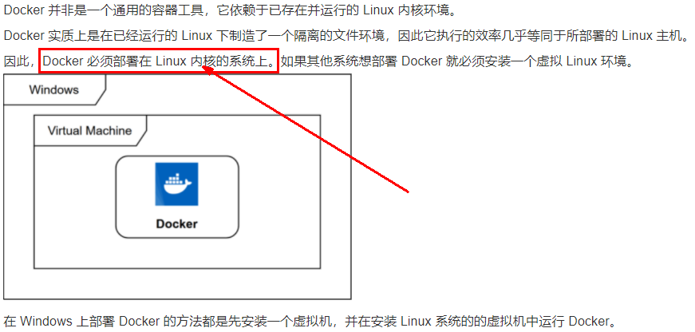
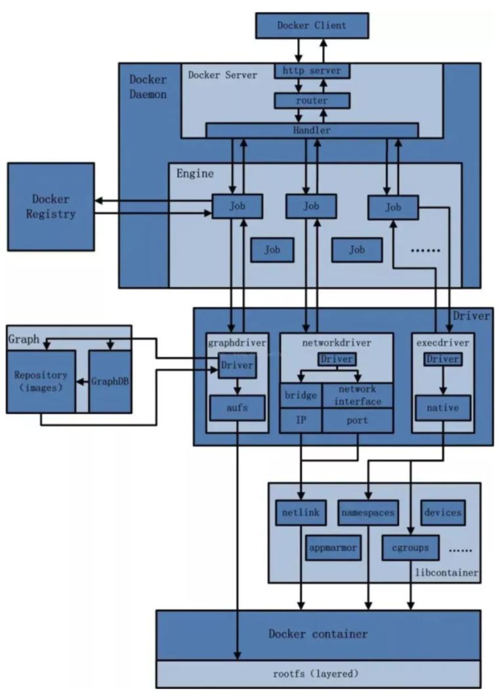
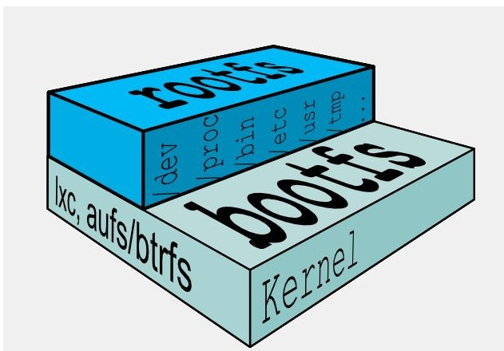

# Docker

# 一、Docker简介

## 1、docker是什么

### 1-1、为什么会有docker的出现

假定您在开发一个尚硅谷的谷粒商城，您使用的是一台笔记本电脑而且您的开发环境具有特定的配置。其他开发人员身处的环境配置也各有不同。您正在开发的应用依赖于您当前的配置且还要依赖于某些配置文件。此外，您的企业还拥有标准化的测试和生产环境，且具有自身的配置和一系列支持文件。您希望尽可能多在本地模拟这些环境而不产生重新创建服务器环境的开销。请问？您要如何确保应用能够在这些环境中运行和通过质量检测？并且在部署过程中不出现令人头疼的版本、配置问题，也无需重新编写代码和进行故障修复？


答案就是使用容器。Docker之所以发展如此迅速，也是因为它对此给出了一个标准化的解决方案-----**系统平滑移植，容器虚拟化技术**。


环境配置相当麻烦，换一台机器，就要重来一次，费力费时。很多人想到，能不能从根本上解决问题，**软件可以带环境安装**？也就是说，**安装的时候，把原始环境一模一样地复制过来。开发人员利用 Docker 可以消除协作编码时“在我的机器上可正常工作”的问题。**


之前在服务器配置一个应用的运行环境，要安装各种软件，就拿尚硅谷电商项目的环境来说，Java/RabbitMQ/MySQL/JDBC驱动包等。安装和配置这些东西有多麻烦就不说了，它还不能跨平台。假如我们是在 Windows 上安装的这些环境，到了 Linux 又得重新装。况且就算不跨操作系统，换另一台同样操作系统的服务器，要移植应用也是非常麻烦的。
传统上认为，软件编码开发/测试结束后，所产出的成果即是程序或是能够编译执行的二进制字节码等(java为例)。而为了让这些程序可以顺利执行，开发团队也得准备完整的部署文件，让运维团队得以部署应用程式，<u>开发需要清楚的告诉运维部署团队，用的全部配置文件+所有软件环境。不过，即便如此，仍然常常发生部署失败的状况</u>。**Docker的出现使得Docker得以打破过去「程序即应用」的观念。透过镜像(images)将作业系统核心除外，运作应用程式所需要的系统环境，由下而上打包，达到应用程式跨平台间的无缝接轨运作**。

### 1-2、docker理念

**Docker是基于Go语言实现的云开源项目。**
Docker的主要目标是“Build，Ship and Run Any App,Anywhere”，也就是通过对应用组件的封装、分发、部署、运行等生命周期的管理，使用户的APP（可以是一个WEB应用或数据库应用等等）及其运行环境能够做到“**一次镜像，处处运行**”。


**Linux容器技术的出现就解决了这样一个问题，而 Docker 就是在它的基础上发展过来的**。将应用打成镜像，通过镜像成为运行在Docker容器上面的实例，而 Docker容器在任何操作系统上都是一致的，这就实现了跨平台、跨服务器。**只需要一次配置好环境，换到别的机子上就可以一键部署好，大大简化了操作。**

一句话：解决了**运行环境和配置问题的软件容器**，方便做持续集成并有助于整体发布的容器虚拟化技术。

## 2、容器与虚拟机比较

### 2-1、容器发展简史

 

 

### 2-2、传统虚拟机技术

虚拟机（virtual machine）就是带环境安装的一种解决方案。
它可以在一种操作系统里面运行另一种操作系统，比如在Windows10系统里面运行Linux系统CentOS7。应用程序对此毫无感知，因为虚拟机看上去跟真实系统一模一样，而对于底层系统来说，虚拟机就是一个普通文件，不需要了就删掉，对其他部分毫无影响。这类虚拟机完美的运行了另一套系统，能够使应用程序，操作系统和硬件三者之间的逻辑不变。  


虚拟机的缺点：

1. 资源占用多
2. 冗余步骤多
3. 启动慢

### 2-3、容器虚拟化技术

由于前面虚拟机存在某些缺点，Linux发展出了另一种虚拟化技术：**Linux容器(Linux Containers，缩写为 LXC)**
Linux容器是与系统其他部分隔离开的一系列进程，从另一个镜像运行，并由该镜像提供支持进程所需的全部文件。容器提供的镜像包含了应用的所有依赖项，因而在从开发到测试再到生产的整个过程中，它都具有可移植性和一致性。

**Linux 容器不是模拟一个完整的操作系统而是对进程进行隔离**。有了容器，就可以将软件运行所需的所有资源打包到一个隔离的容器中。**容器与虚拟机不同，不需要捆绑一整套操作系统**，只需要软件工作所需的库资源和设置。系统因此而变得高效轻量并保证部署在任何环境中的软件都能始终如一地运行。


### 2-4、对比

比较了 Docker 和传统虚拟化方式的不同之处：

1. 传统虚拟机技术是虚拟出一套硬件后，在其上运行一个完整操作系统，在该系统上再运行所需应用进程；
2. 容器内的应用进程直接运行于宿主的内核，容器内没有自己的内核**且也没有进行硬件虚拟**。因此容器要比传统虚拟机更为轻便。
3. 每个容器之间互相隔离，每个容器有自己的文件系统 ，容器之间进程不会相互影响，能区分计算资源。

## 3、docker能解决的问题

技术职级变化：coder -> programmer -> software engineer -> DevOps engineer

### 3-1、开发/运维（DevOps）新一代开发工程师

一次构建、随处运行：

1. 更快速的应用交付和部署

   传统的应用开发完成后，需要提供一堆安装程序和配置说明文档，安装部署后需根据配置文档进行繁杂的配置才能正常运行。Docker化之后只需要交付少量容器镜像文件，在正式生产环境加载镜像并运行即可，应用安装配置在镜像里已经内置好，大大节省部署配置和测试验证时间。

2. 更便捷的升级和扩缩容

   随着微服务架构和Docker的发展，大量的应用会通过微服务方式架构，应用的开发构建将变成搭乐高积木一样，每个Docker容器将变成一块“积木”，应用的升级将变得非常容易。当现有的容器不足以支撑业务处理时，可通过镜像运行新的容器进行快速扩容，使应用系统的扩容从原先的天级变成分钟级甚至秒级。

3. 更简单的系统运维

   应用容器化运行后，生产环境运行的应用可与开发、测试环境的应用高度一致，容器会将应用程序相关的环境和状态完全封装起来，不会因为底层基础架构和操作系统的不一致性给应用带来影响，产生新的BUG。当出现程序异常时，也可以通过测试环境的相同容器进行快速定位和修复。

4. 更高效的计算资源利用

   **Docker是内核级虚拟化**，其不像传统的虚拟化技术一样需要额外的Hypervisor支持，所以在一台物理机上可以运行很多个容器实例，可大大提升物理服务器的CPU和内存的利用率。

### 3-2、Docker应用场景

 

### 3-3、哪些企业在使用

1. 美团

    

    

##  4、下载

docker官网：http://www.docker.com

Docker Hub官网: https://hub.docker.com/

# 二、Docker安装

## 1、前提说明

1. Centos Docker安装

    

2. 目前，CentOS 仅发行版本中的内核支持 Docker。Docker 运行在CentOS 7 (64-bit)上，要求系统为64位、Linux系统内核版本为 3.8以上，这里选用Centos7.x

   查看自己的内核
   uname命令用于打印当前系统相关信息（内核版本号、硬件架构、主机名称和操作系统类型等）。

     

## 2、Docker的基本组成

1. 镜像(image)

   Docker 镜像（Image）就是一个**只读**的模板。镜像可以用来创建 Docker 容器，**一个镜像可以创建很多容器**。
   它也相当于是一个root文件系统。比如官方镜像 centos 7 就包含了完整的一套 centos 7 最小系统的 root 文件系统。
   相当于容器的“源代码”，**docker镜像文件类似于Java的类，而docker容器实例类似于java中new出来的实例对象**。

    

2. 容器(container)

   - 从面向对象角度
     Docker 利用容器（Container）独立运行的一个或一组应用，应用程序或服务运行在容器里面，容器就类似于一个虚拟化的运行环境，**容器是用镜像创建的运行实例**。就像是Java中的类和实例对象一样，镜像是静态的定义，容器是镜像运行时的实体。容器为镜像提供了一个标准的和隔离的运行环境，它可以被启动、开始、停止、删除。每个容器都是相互隔离的、保证安全的平台
   - 从镜像容器角度
     **可以把容器看做是一个简易版的 Linux 环境**（包括root用户权限、进程空间、用户空间和网络空间等）和运行在其中的应用程序。

3. 仓库(repository)

   仓库（Repository）是**集中存放镜像文件的场所**。

   类似于Maven仓库，存放各种jar包的地方；github仓库，存放各种git项目的地方；Docker公司提供的官方registry被称为Docker Hub，存放各种镜像模板的地方。

   仓库分为公开仓库（Public）和私有仓库（Private）两种形式。
   **最大的公开仓库是 Docker Hub(https://hub.docker.com/)，**
   存放了数量庞大的镜像供用户下载。国内的公开仓库包括阿里云 、网易云等

小总结：

需要正确的理解仓库/镜像/容器这几个概念:
Docker 本身是一个容器运行载体或称之为管理引擎。我们把应用程序和配置依赖打包好形成一个可交付的运行环境，这个打包好的运行环境就是image镜像文件。只有通过这个镜像文件才能生成Docker容器实例(类似Java中new出来一个对象)。

image文件可以看作是容器的模板。Docker 根据 image 文件生成容器的实例。同一个 image 文件，可以生成多个同时运行的容器实例。

镜像文件

*  image 文件生成的容器实例，本身也是一个文件，称为镜像文件。

容器实例

*  一个容器运行一种服务，当我们需要的时候，就可以通过docker客户端创建一个对应的运行实例，也就是我们的容器

仓库

*  就是放一堆镜像的地方，我们可以把镜像发布到仓库中，需要的时候再从仓库中拉下来就可以了。

### 2-1、Docker平台架构图解(入门版)

 

docker的工作原理

Docker是一个Client-Server结构的系统，Docker守护进程运行在主机上， 然后通过Socket连接从客户端访问，守护进程从客户端接受命令并管理运行在主机上的容器。 容器，是一个运行时环境，就是我们前面说到的集装箱。可以对比mysql演示对比讲解


### 2-2、Docker平台架构图解(架构版)

整体架构及底层通信原理简述

- Docker 是一个 C/S 模式的架构，后端是一个松耦合架构，众多模块各司其职。

   

   

## 3、CentOS7安装Docker

安装地址：https://docs.docker.com/engine/install/centos/

1. 确定你是CentOS7及以上版本

   ```shell
   [root@localhost ~]# cat /etc/redhat-release
   CentOS Linux release 7.4.1708 (Core)
   ```

2. 卸载旧版本

   ```shell
   sudo yum remove docker \
                     docker-client \
                     docker-client-latest \
                     docker-common \
                     docker-latest \
                     docker-latest-logrotate \
                     docker-logrotate \
                     docker-engine
   ```

3. yum安装gcc相关

   > 确保能连接网络

   ```shell
   [root@localhost ~]# yum -y install gcc
   ...
   [root@localhost ~]# yum -y install gcc-c++
   ...
   ```

4. 安装需要的软件包

   ```shell
   [root@localhost ~]# yum install -y yum-utils
   ```

5. 设置stable镜像仓库

   大坑：由于官网的镜像仓库路径是外网路径，后面会经常出错

    

    正确的镜像仓库路径：http://mirrors.aliyun.com/docker-ce/linux/centos/docker-ce.repo

   ```shell
   [root@localhost ~]# yum-config-manager --add-repo http://mirrors.aliyun.com/docker-ce/linux/centos/docker-ce.repo
   ```

6. 更新yum软件包索引

   ```shell
   [root@localhost ~]# yum makecache fast
   ```

7. 安装DOCKER CE

   ```shell
   [root@localhost ~]# yum -y install docker-ce docker-ce-cli containerd.io
   ```

   执行结果：

    

8. 启动docker

   ```shell
   systemctl start docker
   ```

9. 测试

   ```shell
   [root@localhost ~]# docker version
   ```

     

   ```shell
   [root@localhost ~]# docker run hello-world
   ```

     

   如上代表docker运行正常！

10. 停止docker服务

    ```shell
    systemctl stop docker 
    ```

11. 卸载docker服务流程

    ```shell
    # 停止docker服务
    [root@localhost ~]# systemctl stop docker 
    
    [root@localhost ~]# yum remove docker-ce docker-ce-cli containerd.io
    
    [root@localhost ~]# rm -rf /var/lib/docker
    [root@localhost ~]# rm -rf /var/lib/containerd
    ```

## 4、阿里云镜像加速

官网：https://promotion.aliyun.com/ntms/act/kubernetes.html

1. 注册一个属于自己的阿里云账户(可复用淘宝账号)

2. 获得加速器地址连接

   1. 登陆阿里云开发者平台

   2. 点击右上控制台

   3. 选择容器镜像服务

       

   4. 获取加速器地址

       

3. 配置镜像加速器(方法1)

   > 推荐安装1.10.0以上版本的Docker客户端

   您可以通过修改daemon配置文件`/etc/docker/daemon.json`来使用加速器

   ```shell
   sudo mkdir -p /etc/docker
   sudo tee /etc/docker/daemon.json <<-'EOF'
   {
     "registry-mirrors": ["https://jaegpoww.mirror.aliyuncs.com"]
   }
   EOF
   sudo systemctl daemon-reload
   sudo systemctl restart docker
   ```

   ```shell
   [root@localhost ~]# mkdir -p /etc/docker
   [root@localhost ~]# tee /etc/docker/daemon.json <<-'EOF'
   > {
   >   "registry-mirrors": ["https://jaegpoww.mirror.aliyuncs.com"]
   > }
   > EOF
   {
     "registry-mirrors": ["https://jaegpoww.mirror.aliyuncs.com"]
   }
   [root@localhost ~]# sudo systemctl daemon-reload
   [root@localhost ~]# sudo systemctl restart docker
   ```

4. 配置镜像加速器(方法2)

   ```shell
   [root@localhost ~]# mkdir -p /etc/docker
   [root@localhost ~]# vim  /etc/docker/daemon.json
   {
     "registry-mirrors": ["https://｛自已的编码｝.mirror.aliyuncs.com"]
   }
   ```

## 5、docker hello-world解析

1. 启动Docker后台容器(测试运行 hello-world)

   ```shell
   [root@localhost ~]# docker run hello-world
   ```

    

2. run干了什么

     

## 6、为什么Docker会比VM虚拟机快

1. docker有着比虚拟机更少的抽象层
   由于docker不需要Hypervisor(虚拟机)实现硬件资源虚拟化,运行在docker容器上的程序直接使用的都是实际物理机的硬件资源。因此在CPU、内存利用率上docker将会在效率上有明显优势。
2. docker利用的是宿主机的内核,而不需要加载操作系统OS内核
   当新建一个容器时,docker不需要和虚拟机一样重新加载一个操作系统内核。进而避免引寻、加载操作系统内核返回等比较费时费资源的过程,当新建一个虚拟机时,虚拟机软件需要加载OS,返回新建过程是分钟级别的。而docker由于直接利用宿主机的操作系统,则省略了返回过程,因此新建一个docker容器只需要几秒钟。


# 三、Docker常用命令

## 1、帮助启动类命令

1. 启动docker

   ```shell
   [root@localhost ~]# systemctl start docker
   ```

2. 停止docker

   ```shell
   [root@localhost ~]# systemctl stop docker
   ```

3. 重启docker

   ```shell
   [root@localhost ~]# systemctl restart docker
   ```

4. 查看docker状态： systemctl status docker

   ```shell
   [root@localhost ~]# systemctl status docker
   ```

5. 开机启动： systemctl enable docker

   ```shell
   [root@localhost ~]# systemctl enable docker
   ```

6. 查看docker概要信息

   ```shell
   [root@localhost ~]# docker info
   ```

7. 查看docker总体帮助文档

   ```shell
   [root@localhost ~]# docker --help
   ```

8. 查看docker命令帮助文档：

   ```shell
   [root@localhost ~]# docker 具体命令 --help
   ```


docker命令套用：docker [OPTIONS] COMMAND

## 2、镜像命令

### 2-1、docker images 

> 功能：列出本地主机上的镜像

> docker images [OPTIONS]

```shell
[root@localhost ~]# docker images
REPOSITORY    TAG          IMAGE ID       CREATED         SIZE
hello-world   latest       feb5d9fea6a5   7 months ago    13.3kB
rabbitmq      management   246db2517862   11 months ago   186MB
```

各个选项说明:

- REPOSITORY：表示镜像的仓库源
- TAG：镜像的标签版本号
- IMAGE ID：镜像ID
- CREATED：镜像创建时间
- SIZE：镜像大小

同一仓库源可以有多个TAG版本，代表这个仓库源的不同个版本，我们使用 REPOSITORY:TAG 来定义不同的镜像。

如果你不指定一个镜像的版本标签，例如你只使用 ubuntu，docker 将默认使用 ubuntu:latest 镜像

OPTIONS说明：

- -a :列出本地所有的镜像（含历史映像层）

  ```shell
  [root@localhost ~]# docker images -a
  REPOSITORY    TAG          IMAGE ID       CREATED         SIZE
  hello-world   latest       feb5d9fea6a5   7 months ago    13.3kB
  rabbitmq      management   246db2517862   11 months ago   186MB
  ```

- -q :只显示镜像ID。

  ```shell
  [root@localhost ~]# docker images -q
  feb5d9fea6a5
  246db2517862
  ```

### 2-2、docker search

> 功能：镜像仓库查询镜像

镜像仓库：https://hub.docker.com

命令：

> docker search [OPTIONS] 镜像名字

```shell
[root@localhost ~]# docker search redis
NAME                                               DESCRIPTION                                     STARS     OFFICIAL   AUTOMATED
redis                                              Redis is an open source key-value store that…   10924     [OK]       
bitnami/redis                                      Bitnami Redis Docker Image                      217                  [OK]
bitnami/redis-sentinel                             Bitnami Docker Image for Redis Sentinel         36                   [OK]
bitnami/redis-cluster                                                                              31                   
circleci/redis                                     CircleCI images for Redis                       12                   [OK]
...
```

各个选项说明:

- NAME：镜像名称
- DESCRIPTION：镜像说明
- STARS：点赞数量
- OFFICIAL：是否是官方的
- AUTOMATED：是否是自动构建的

OPTIONS说明：

- --limit : 只列出N个镜像，默认25个

  ```shell
  [root@localhost ~]# docker search --limit 1 hello-world
  NAME          DESCRIPTION                                     STARS     OFFICIAL   AUTOMATED
  hello-world   Hello World! (an example of minimal Dockeriz…   1738      [OK]
  ```

### 2-3、docker pull

> 功能：下载镜像

> docker pull 镜像名字[:TAG]

没有TAG默认最新版 == docker pull 镜像名字:latest

```shell
[root@localhost ~]# docker pull redis
Using default tag: latest
latest: Pulling from library/redis
....
Digest: sha256:db485f2e245b5b3329fdc7eff4eb00f913e09d8feb9ca720788059fdc2ed8339
Status: Downloaded newer image for redis:latest
docker.io/library/redis:latest
[root@localhost ~]# docker images
REPOSITORY    TAG          IMAGE ID       CREATED         SIZE
redis         latest       7614ae9453d1   4 months ago    113MB
hello-world   latest       feb5d9fea6a5   7 months ago    13.3kB
rabbitmq      management   246db2517862   11 months ago   186MB
```

### 2-4、docker system df

> 功能：查看镜像/容器/数据卷所占的空间

```shell
[root@localhost ~]# docker system df
TYPE            TOTAL     ACTIVE    SIZE      RECLAIMABLE
Images          4         2         371.8MB   185.5MB (49%)
Containers      3         0         567B      567B (100%)
Local Volumes   2         1         507.7MB   0B (0%)
Build Cache     0         0         0B        0B
```

### 2-5、docker rmi

> 功能：删除镜像

- 删除单个

  > docker rmi -f 镜像ID

  ```shell
  [root@localhost ~]# docker rmi feb5d9fea6a5
  Error response from daemon: conflict: unable to delete feb5d9fea6a5 (must be forced) - image is being used by stopped container b0dfb628353c #镜像被容器使用中 需要-f强制删除
  [root@localhost ~]# docker rmi -f feb5d9fea6a5
  Untagged: hello-world:latest
  Untagged: hello-world@sha256:2498fce14358aa50ead0cc6c19990fc6ff866ce72aeb5546e1d59caac3d0d60f
  Deleted: sha256:feb5d9fea6a5e9606aa995e879d862b825965ba48de054caab5ef356dc6b3412
  [root@localhost ~]# docker images
  REPOSITORY   TAG          IMAGE ID       CREATED         SIZE
  redis        latest       7614ae9453d1   4 months ago    113MB
  ubuntu       latest       ba6acccedd29   7 months ago    72.8MB
  rabbitmq     management   246db2517862   11 months ago   186MB
  ```

- 删除多个

  > docker rmi -f 镜像ID1 镜像ID2...

  ```shell
  [root@localhost ~]# docker rmi -f feb5d9fea6a5 ba6acccedd29
  Untagged: hello-world:latest
  Untagged: hello-world@sha256:2498fce14358aa50ead0cc6c19990fc6ff866ce72aeb5546e1d59caac3d0d60f
  Deleted: sha256:feb5d9fea6a5e9606aa995e879d862b825965ba48de054caab5ef356dc6b3412
  Untagged: ubuntu:latest
  Untagged: ubuntu@sha256:626ffe58f6e7566e00254b638eb7e0f3b11d4da9675088f4781a50ae288f3322
  Deleted: sha256:ba6acccedd2923aee4c2acc6a23780b14ed4b8a5fa4e14e252a23b846df9b6c1
  Deleted: sha256:9f54eef412758095c8079ac465d494a2872e02e90bf1fb5f12a1641c0d1bb78b
  ```

- 删除全部

  > docker rmi -f $(docker images -qa)

  ```shell
  [root@localhost ~]# docker rmi -f $(docker images -qa)
  # $(docker images -qa)内获取到的所有镜像id
  ```

### 2-6、docker虚悬镜像

docker虚悬镜像：仓库名、标签都是<none>的镜像，俗称虚悬镜像dangling image


虚悬镜像建议删除，否则docker部署可能出问题

## 3、容器命令

`有镜像才能创建容器，这是根本前提(下载一个CentOS或者ubuntu镜像演示)`


```shell
[root@localhost ~]# docker pull centos 
/
[root@localhost ~]# docker pull ubuntu
```

ubuntu比较小，本次演示用ubuntu演示

### 1、新建+启动容器

> docker run [OPTIONS] `IMAGE` [COMMAND] [ARG...]

OPTIONS说明（常用）：有些是一个减号，有些是两个减号

- --name="容器新名字"：为容器指定一个名称；

- -d: 后台运行容器并返回容器ID，也即启动守护式容器(后台运行)；

- `-i：以交互模式运行容器，通常与 -t 同时使用；`

- `-t：为容器重新分配一个伪输入终端，通常与 -i 同时使用；也即启动交互式容器(前台有伪终端，等待交互)；`

- -P: `随机`端口映射，大写P

- -p: `指定`端口映射，小写p

   

启动交互式容器(前台命令行)

```shell
# 使用镜像ubuntu:latest以交互模式启动一个容器,在容器内执行/bin/bash命令。
[root@localhost ~]# docker run -it ubuntu /bin/bash
root@413096c04b0a:/# 
```

参数说明：

- -i: 交互式操作。
- -t: 终端。
- ubuntu: ubuntu镜像。
- /bin/bash：放在镜像名后的是命令，这里我们希望有个交互式 Shell，因此用的是 /bin/bash。
  要退出终端，直接输入 exit:

- 

### 2、列出当前所有正在运行的容器

>  docker ps [OPTIONS]

```shell
[root@localhost ~]# docker ps
CONTAINER ID   IMAGE     COMMAND       CREATED         STATUS         PORTS     NAMES
413096c04b0a   ubuntu    "/bin/bash"   5 minutes ago   Up 5 minutes             hopeful_mayer
```

再启动一个终端,启动一个容器并指定容器名称：

```shell
[root@localhost ~]# docker run -it --name=myu01 ubuntu bash
root@066f37b889de:/# 
```

查看正常运行的容器：

```shell
[root@localhost ~]# docker ps
CONTAINER ID   IMAGE     COMMAND       CREATED          STATUS          PORTS     NAMES
066f37b889de   ubuntu    "bash"        31 seconds ago   Up 30 seconds             myu01
413096c04b0a   ubuntu    "/bin/bash"   8 minutes ago    Up 8 minutes              hopeful_mayer
```

OPTIONS说明（常用）：

- -a :列出当前所有**正在运行**的容器+**历史上运行过**的

  ```shell
  [root@localhost ~]# docker ps -a
  CONTAINER ID   IMAGE         COMMAND       CREATED          STATUS                      PORTS     NAMES
  066f37b889de   ubuntu        "bash"        2 minutes ago    Up 2 minutes                          myu01
  413096c04b0a   ubuntu        "/bin/bash"   10 minutes ago   Exited (0) 13 seconds ago             hopeful_mayer
  2cb88e07b8e8   hello-world   "/hello"      3 days ago       Exited (0) 3 days ago                 optimistic_hertz
  47fce1b3b8ae   hello-world   "/hello"      3 days ago       Exited (0) 3 days ago                 compassionate_nightingale
  ```

- -l :显示最近创建的一个容器。

  ```shell
  [root@localhost ~]# docker ps -l
  CONTAINER ID   IMAGE     COMMAND   CREATED         STATUS         PORTS     NAMES
  066f37b889de   ubuntu    "bash"    3 minutes ago   Up 3 minutes             myu01
  ```

- -n：显示最近n个创建的容器。

  ```shell
  [root@localhost ~]# docker ps -n 2
  CONTAINER ID   IMAGE     COMMAND       CREATED         STATUS         PORTS     NAMES
  292fdc8c4a43   ubuntu    "/bin/bash"   2 minutes ago   Up 2 minutes             trusting_gould
  066f37b889de   ubuntu    "bash"        7 minutes ago   Up 7 minutes             myu01
  ```

- **-q :静默模式，只显示容器编号。**

  ```shell
  [root@localhost ~]# docker ps -q
  292fdc8c4a43
  066f37b889de
  ```

### 3、退出容器

两种退出方式：

- exit：run进去容器，exit退出，容器停止

  ```shell
  # 启动两个容器
  [root@localhost ~]# docker ps
  CONTAINER ID   IMAGE     COMMAND       CREATED          STATUS          PORTS     NAMES
  ed78bf298177   ubuntu    "/bin/bash"   17 seconds ago   Up 17 seconds             festive_chandrasekhar
  d5bf83ad5c63   ubuntu    "/bin/bash"   28 seconds ago   Up 28 seconds             pedantic_pasteur
  root@ed78bf298177:/# exit
  exit
  [root@localhost ~]# docker ps
  CONTAINER ID   IMAGE     COMMAND       CREATED         STATUS         PORTS     NAMES
  d5bf83ad5c63   ubuntu    "/bin/bash"   2 minutes ago   Up 2 minutes             pedantic_pasteur
  ```

- ctrl+p+q：run进去容器，ctrl+p+q退出，`容器不停止`

### 4、启动已停止运行的容器

> docker start 容器ID或者容器名

```shell
[root@localhost ~]# docker start ed78bf298177
ed78bf298177
[root@localhost ~]# docker ps
CONTAINER ID   IMAGE     COMMAND       CREATED         STATUS         PORTS     NAMES
ed78bf298177   ubuntu    "/bin/bash"   7 minutes ago   Up 6 seconds             festive_chandrasekhar
d5bf83ad5c63   ubuntu    "/bin/bash"   7 minutes ago   Up 7 minutes             pedantic_pasteur
```

### 5、进入正在运行的容器

> docker exec -it 容器名或id /bin/bash

```shell
[root@localhost ~]# docker exec -it d5bf83ad5c63 /bin/bash
root@d5bf83ad5c63:/# 
```

### 6、重启容器

> docker restart 容器ID或者容器名

### 7、停止容器

> docker stop 容器ID或者容器名

### 8、强制停止容器

> docker kill 容器ID或容器名

### 9、删除已停止的容器

> docker rm [-f] 容器ID

-f：强制删除

- `一次性删除多个容器实例`

  > docker rm -f $(docker ps -a -q)

  > docker ps -a -q | xargs docker rm

### 10、重要指令

> 有镜像才能创建容器，这是根本前提(下载一个Redis6.0.8镜像演示)

#### 10-1、启动守护式容器(后台服务器)

`在大部分的场景下，我们希望 docker 的服务是在后台运行的，我们可以过 -d 指定容器的后台运行模式。`

> docker run -d 容器名

```shell
#使用镜像ubuntu:latest以后台模式启动一个容器
docker run -d ubuntu
[root@localhost ~]# docker run -d ubuntu
d6535376e760cb6d113cdb6007b77894551f5b8f484212b2e154af684301205a
[root@localhost ~]# docker ps -a
CONTAINER ID   IMAGE                 COMMAND                  CREATED             STATUS                         PORTS      NAMES
d6535376e760   ubuntu                "bash"                   30 seconds ago      Exited (0) 29 seconds ago                 ecstatic_banach
```

问题：然后docker ps -a 进行查看, 会发现容器已经退出

很重要的要说明的一点: `Docker容器后台运行,就必须有一个前台进程`.容器运行的命令如果不是那些一直挂起的命令（比如运行top，tail），就是会自动退出的。

这个是docker的机制问题,比如你的web容器,我们以nginx为例，正常情况下,我们配置启动服务只需要启动响应的service即可。例如service nginx start但是,这样做,nginx为后台进程模式运行,就导致docker前台没有运行的应用,这样的容器后台启动后,会立即自杀因为他觉得他没事可做了.所以，最佳的解决方案是,`将你要运行的程序以前台进程的形式运行，常见就是命令行模式，表示我还有交互操作`

redis 前后台启动演示case

- 前台交互式启动

   

- 后台守护式启动

  ```shell
  [root@localhost ~]# docker run -d redis:6.0.8
  5e954a955149517ae9d5d21b8f527e0e7fff9a583cfc743ce6b290c6d0f2f68d
  [root@localhost ~]# docker ps
  CONTAINER ID   IMAGE         COMMAND                  CREATED          STATUS          PORTS      NAMES
  5e954a955149   redis:6.0.8   "docker-entrypoint.s…"   3 seconds ago    Up 2 seconds    6379/tcp   compassionate_shockley
  7db84571e936   redis:6.0.8   "docker-entrypoint.s…"   56 seconds ago   Up 55 seconds   6379/tcp   suspicious_faraday
  ```

#### 10-2、查看容器日志

> docker logs 容器ID

```shell
[root@localhost ~]# docker logs 5e954a955149
1:C 16 May 2022 04:30:41.141 # oO0OoO0OoO0Oo Redis is starting oO0OoO0OoO0Oo
1:C 16 May 2022 04:30:41.141 # Redis version=6.0.8, bits=64, commit=00000000, modified=0, pid=1, just started
1:C 16 May 2022 04:30:41.141 # Warning: no config file specified, using the default config. In order to specify a config file use redis-server /path/to/redis.conf
1:M 16 May 2022 04:30:41.143 * Running mode=standalone, port=6379.
1:M 16 May 2022 04:30:41.143 # WARNING: The TCP backlog setting of 511 cannot be enforced because /proc/sys/net/core/somaxconn is set to the lower value of 128.
```

#### 10-3、查看容器内运行的进程

> docker top 容器ID

```shell
[root@localhost ~]# docker top 5e954a955149
UID                 PID                 PPID                C                   STIME               TTY                 TIME                
polkitd             5506                5488                0                   12:30               ?                 00:00:00 

CMD

redis-server *:6379
```

#### 10-4、查看容器内部细节

> docker inspect 容器ID

#### 10-5、`进入正在运行的容器并以命令行交互`

> docker exec -it 容器ID /bin/bash

```shell
[root@localhost ~]# docker exec -it 5e954a955149 /bin/bash
root@5e954a955149:/data#
```

> docker attach 容器ID：重新进入

```shell
[root@localhost ~]# docker attach 7eb34795d9b4
root@7eb34795d9b4:/# 
```

上述两个区别

- attach 直接进入容器启动命令的终端，不会启动新的进程。`用exit退出，会导致容器的停止`
- exec 是在容器中打开新的终端，并且可以启动新的进程。`用exit退出，不会导致容器的停止`

推荐大家使用 docker exec 命令，因为退出容器终端，不会导致容器的停止。

用之前的redis容器实例进入试试,进入redis服务

- `docker exec -it 容器ID /bin/bash`

  ```shell
  [root@localhost ~]# docker ps
  CONTAINER ID   IMAGE         COMMAND                  CREATED         STATUS        PORTS      NAMES
  8e7a46b7c9a9   redis:6.0.8   "docker-entrypoint.s…"   2 seconds ago   Up 1 second   6379/tcp   compassionate_diffie
  [root@localhost ~]# docker exec -it 8e7a46b7c9a9 /bin/bash
  root@8e7a46b7c9a9:/data#
  ```

- `docker exec -it 容器ID redis-cli`

  ```shell
  [root@localhost ~]# docker ps
  CONTAINER ID   IMAGE         COMMAND                  CREATED              STATUS              PORTS      NAMES
  8e7a46b7c9a9   redis:6.0.8   "docker-entrypoint.s…"   About a minute ago   Up About a minute   6379/tcp   compassionate_diffie
  [root@localhost ~]# docker exec -it 8e7a46b7c9a9 redis-cli
  127.0.0.1:6379> 
  ```

`一般用-d后台启动的程序，再用exec进入对应容器实例`

#### 10-6、从容器内拷贝文件到主机上

有时容器需要被删除前，将文件拷贝到主机上

> docker cp  容器ID:容器内路径 目的主机路径

```shell
root@f6a363b4fe2f:/test# touch a.txt
root@f6a363b4fe2f:/test# ls
a.txt

[root@localhost ~]# docker cp f6a363b4fe2f:/test/a.txt /test/
[root@localhost ~]# cd /test
[root@localhost test]# ls
a.txt
```

#### 10-7、导入和导出容器

> export 导出容器的内容留作为一个tar归档文件[对应import命令]
>
> import 从tar包中的内容创建一个新的文件系统再导入为镜像[对应export]
>

案例：

> docker export 容器ID > 文件名.tar

```shell
[root@localhost ~]# docker ps
CONTAINER ID   IMAGE         COMMAND                  CREATED             STATUS             PORTS      NAMES
f6a363b4fe2f   ubuntu        "/bin/bash"              About an hour ago   Up About an hour              admiring_albattani
8e7a46b7c9a9   redis:6.0.8   "docker-entrypoint.s…"   About an hour ago   Up About an hour   6379/tcp   compassionate_diffie
[root@localhost ~]# docker export f6a363b4fe2f > abcd.tar
[root@localhost ~]# ls
abcd.tar         appendonly.aof  dump.rdb              公共  视频  文档  音乐
anaconda-ks.cfg  dump6379.rdb    initial-setup-ks.cfg  模板  图片  下载  桌面
```

> cat 文件名.tar | docker import - 镜像用户/镜像名:镜像版本号

```shell
[root@localhost test]# cat abcd.tar | docker import - geek/ubuntu:lastest
sha256:0e6cd5cb2cb07ca5a85f51c94bcde0ab547f91e62df4acc97ef6e95bfd87ffd9
[root@localhost test]# docker images
REPOSITORY    TAG          IMAGE ID       CREATED          SIZE
geek/ubuntu   lastest      0e6cd5cb2cb0   25 seconds ago   72.8MB
redis         latest       7614ae9453d1   4 months ago     113MB
ubuntu        latest       ba6acccedd29   7 months ago     72.8MB
[root@localhost test]# docker run -it 0e6cd5cb2cb0 /bin/bash
root@7903531596a3:/# cd test
root@7903531596a3:/test# ls
a.txt
```

# 四、Docker镜像

## 1、镜像

### 1-1、镜像的概念

> 镜像是一种轻量级、可执行的独立软件包，它包含运行某个软件所需的所有内容，我们把应用程序和配置依赖打包好形成一个可交付的运行环境(包括代码、运行时需要的库、环境变量和配置文件等)，这个打包好的运行环境就是image镜像文件。
>
> 只有通过这个镜像文件才能生成Docker容器实例(类似Java中new出来一个对象)。

### 1-2、分层的镜像

> 以我们的pull为例，在下载的过程中我们可以看到docker的镜像好像是在一层一层的在下载
>

 

### 1-3、UnionFS（联合文件系统）

UnionFS（联合文件系统）：Union文件系统（UnionFS）是一种分层、轻量级并且高性能的文件系统，它支持`对文件系统的修改作为一次提交来一层层的叠加`，同时可以将不同目录挂载到同一个虚拟文件系统下(unite several directories into a single virtual filesystem)。Union 文件系统是 Docker 镜像的基础。`镜像可以通过分层来进行继承`，基于基础镜像（没有父镜像），可以制作各种具体的应用镜像。

特性：一次同时加载多个文件系统，但从外面看起来，只能看到一个文件系统，联合加载会把各层文件系统叠加起来，这样最终的文件系统会包含所有底层的文件和目录

### 1-4、Docker镜像加载原理

docker的镜像实际上由一层一层的文件系统组成，这种层级的文件系统UnionFS。
bootfs(boot file system)主要包含bootloader和kernel, bootloader主要是引导加载kernel, Linux刚启动时会加载bootfs文件系统，`在Docker镜像的最底层是引导文件系统bootfs`。这一层与我们典型的Linux/Unix系统是一样的，包含boot加载器和内核。当boot加载完成之后整个内核就都在内存中了，此时内存的使用权已由bootfs转交给内核，此时系统也会卸载bootfs。

rootfs (root file system) ，在bootfs之上。包含的就是典型 Linux 系统中的 /dev, /proc, /bin, /etc 等标准目录和文件。rootfs就是各种不同的操作系统发行版，比如Ubuntu，Centos等等。 

 

> 平时我们安装进虚拟机的CentOS都是好几个G，为什么docker这里才200M？？

对于一个精简的OS，rootfs可以很小，只需要包括最基本的命令、工具和程序库就可以了，因为底层直接用Host的kernel，自己只需要提供 rootfs 就行了。由此可见对于不同的linux发行版, bootfs基本是一致的, rootfs会有差别, 因此不同的发行版可以公用bootfs。

### 1-5、为什么 Docker 镜像要采用这种分层结构

镜像分层最大的一个好处就是共享资源，方便复制迁移，就是为了**复用**。

比如说有多个镜像都从相同的 base 镜像构建而来，那么 Docker Host 只需在磁盘上保存一份 base 镜像；
同时内存中也只需加载一份 base 镜像，就可以为所有容器服务了。而且镜像的每一层都可以被共享。

## 2、重点理解

> `Docker镜像层都是只读的，容器层是可写的`

当容器启动时，一个新的可写层被加载到镜像的顶部。这一层通常被称作“容器层”，“容器层”之下的都叫“镜像层”。

所有对容器的改动 - 无论添加、删除、还是修改文件都只会发生在容器层中。只有容器层是可写的，容器层下面的所有镜像层都是只读的。

 

## 3、Docker镜像commit操作案例

`docker commit提交容器副本使之成为一个新的镜像`

> docker commit -m="提交的描述信息" -a="作者" 容器ID 要创建的目标镜像名:[标签名]

案例演示ubuntu安装vim

1. 从Hub上下载ubuntu镜像到本地并成功运行

2. `原始的默认Ubuntu镜像是不带着vim命令的`

   ```shell
   root@96a782ba963c:/# vim a.txt
   bash: vim: command not found
   ```

3. 外网连通的情况下，安装vim

   ```shell
   #更新包管理工具
   root@96a782ba963c:/# apt-get update
   ...
   Fetched 22.1 MB in 11s (1976 kB/s)                                                                                           
   Reading package lists... Done
   # 安装vim
   root@96a782ba963c:/# apt-get -y install vim
   ...
   root@96a782ba963c:/# vim a.txt
   ```

4. 安装完成后，commit我们自己的新镜像

   ```shell
   [root@localhost ~]# docker commit -m="add vim cmd" -a="lambert" 96a782ba963c geek/myubuntu:1.1
   sha256:f304cdbd6b63d517fb73c684dd3aabff3c3cef28a8efef8a2684102efde267cc
   [root@localhost ~]# docker images
   REPOSITORY      TAG          IMAGE ID       CREATED          SIZE
   geek/myubuntu   1.1          f304cdbd6b63   16 seconds ago   176MB
   ubuntu          latest       ba6acccedd29   7 months ago     72.8MB
   ```

5. 启动我们的新镜像并和原来的对比

   ```shell
   [root@localhost ~]# docker run -it ubuntu /bin/bash
   root@7505f7a04ea4:/# ls
   bin  boot  dev  etc  home  lib  lib32  lib64  libx32  media  mnt  opt  proc  root  run  sbin  srv  sys  tmp  usr  var
   root@7505f7a04ea4:/# vim a.txt
   bash: vim: command not found
   root@7505f7a04ea4:/# exit
   exit
   [root@localhost ~]# docker run -it f304cdbd6b63 /bin/bash
   root@b84c4a94a1db:/# ls
   a.txt  bin  boot  dev  etc  home  lib  lib32  lib64  libx32  media  mnt  opt  proc  root  run  sbin  srv  sys  tmp  usr  var
   root@b84c4a94a1db:/# vim a.txt
   ```

## 4、小总结

Docker中的镜像分层，`支持通过扩展现有镜像，创建新的镜像`。类似Java继承于一个Base基础类，自己再按需扩展。
新镜像是从 base 镜像一层一层叠加生成的。每安装一个软件，就在现有镜像的基础上增加一层


# 五、本地镜像发布到阿里云

## 1、本地镜像发布到阿里云流程


## 2、镜像的生成方法

> 基于当前容器创建一个新的镜像，新功能增强
> docker commit [OPTIONS] 容器ID [REPOSITORY[:TAG]]

后面的DockerFile章节，第2种方法

## 3、将本地镜像推送到阿里云

### 3-1、本地镜像素材原型

 

### 3-2、阿里云开发者平台

https://promotion.aliyun.com/ntms/act/kubernetes.html

### 3-3、创建仓库镜像

1. 选择右上角控制台，进入容器镜像服务

2. 选择个人实例（没有可以新建一个）

    

3. 新建命名空间

    

4. 新建镜像仓库

    

    

5. 进入管理界面获得脚本命令

    

## 4、将镜像推送到阿里云registry

> 管理界面脚本

 

> 脚本实例(这里选择上面的第三条脚本实例)

```shell
[root@localhost test]# docker login --username=lambert班 registry.cn-hangzhou.aliyuncs.com
Password: 
WARNING! Your password will be stored unencrypted in /root/.docker/config.json.
Configure a credential helper to remove this warning. See
https://docs.docker.com/engine/reference/commandline/login/#credentials-store

Login Succeeded
[root@localhost test]# docker tag f304cdbd6b63 registry.cn-hangzhou.aliyuncs.com/lam_dockerstudy/myubuntu:1.1
[root@localhost test]# docker push registry.cn-hangzhou.aliyuncs.com/lam_dockerstudy/myubuntu:1.1
The push refers to repository [registry.cn-hangzhou.aliyuncs.com/lam_dockerstudy/myubuntu]
747dcca8bea3: Pushed 
9f54eef41275: Pushed 
1.1: digest: sha256:c09165519445a5f62c8e0f72a63d68f2c4e4ac8ed83e174399c7af247e3ef023 size: 741
```

> 远程库：

 

## 5、将阿里云上的镜像下载到本地

```shell
#先删除本地的镜像后再拉取镜像
[root@localhost test]# docker pull registry.cn-hangzhou.aliyuncs.com/lam_dockerstudy/myubuntu:1.1
1.1: Pulling from lam_dockerstudy/myubuntu
7b1a6ab2e44d: Already exists 
73a8c64ac8c7: Already exists 
Digest: sha256:c09165519445a5f62c8e0f72a63d68f2c4e4ac8ed83e174399c7af247e3ef023
Status: Downloaded newer image for registry.cn-hangzhou.aliyuncs.com/lam_dockerstudy/myubuntu:1.1
registry.cn-hangzhou.aliyuncs.com/lam_dockerstudy/myubuntu:1.1
[root@localhost test]# docker images
REPOSITORY                                                   TAG          IMAGE ID       CREATED          SIZE
registry.cn-hangzhou.aliyuncs.com/lam_dockerstudy/myubuntu   1.1          f304cdbd6b63   45 minutes ago   176M
```

