# Docker

# 一、Docker简介

## 1、docker是什么

### 1-1、为什么会有docker的出现

假定您在开发一个尚硅谷的谷粒商城，您使用的是一台笔记本电脑而且您的开发环境具有特定的配置。其他开发人员身处的环境配置也各有不同。您正在开发的应用依赖于您当前的配置且还要依赖于某些配置文件。此外，您的企业还拥有标准化的测试和生产环境，且具有自身的配置和一系列支持文件。您希望尽可能多在本地模拟这些环境而不产生重新创建服务器环境的开销。请问？您要如何确保应用能够在这些环境中运行和通过质量检测？并且在部署过程中不出现令人头疼的版本、配置问题，也无需重新编写代码和进行故障修复？


答案就是使用容器。Docker之所以发展如此迅速，也是因为它对此给出了一个标准化的解决方案-----**系统平滑移植，容器虚拟化技术**。


环境配置相当麻烦，换一台机器，就要重来一次，费力费时。很多人想到，能不能从根本上解决问题，**软件可以带环境安装**？也就是说，**安装的时候，把原始环境一模一样地复制过来。开发人员利用 Docker 可以消除协作编码时“在我的机器上可正常工作”的问题。**


之前在服务器配置一个应用的运行环境，要安装各种软件，就拿尚硅谷电商项目的环境来说，Java/RabbitMQ/MySQL/JDBC驱动包等。安装和配置这些东西有多麻烦就不说了，它还不能跨平台。假如我们是在 Windows 上安装的这些环境，到了 Linux 又得重新装。况且就算不跨操作系统，换另一台同样操作系统的服务器，要移植应用也是非常麻烦的。
传统上认为，软件编码开发/测试结束后，所产出的成果即是程序或是能够编译执行的二进制字节码等(java为例)。而为了让这些程序可以顺利执行，开发团队也得准备完整的部署文件，让运维团队得以部署应用程式，<u>开发需要清楚的告诉运维部署团队，用的全部配置文件+所有软件环境。不过，即便如此，仍然常常发生部署失败的状况</u>。**Docker的出现使得Docker得以打破过去「程序即应用」的观念。透过镜像(images)将作业系统核心除外，运作应用程式所需要的系统环境，由下而上打包，达到应用程式跨平台间的无缝接轨运作**。

### 1-2、docker理念

**Docker是基于Go语言实现的云开源项目。**
Docker的主要目标是“Build，Ship and Run Any App,Anywhere”，也就是通过对应用组件的封装、分发、部署、运行等生命周期的管理，使用户的APP（可以是一个WEB应用或数据库应用等等）及其运行环境能够做到“**一次镜像，处处运行**”。


**Linux容器技术的出现就解决了这样一个问题，而 Docker 就是在它的基础上发展过来的**。将应用打成镜像，通过镜像成为运行在Docker容器上面的实例，而 Docker容器在任何操作系统上都是一致的，这就实现了跨平台、跨服务器。**只需要一次配置好环境，换到别的机子上就可以一键部署好，大大简化了操作。**

一句话：解决了**运行环境和配置问题的软件容器**，方便做持续集成并有助于整体发布的容器虚拟化技术。

## 2、容器与虚拟机比较

### 2-1、容器发展简史

 

 

### 2-2、传统虚拟机技术

虚拟机（virtual machine）就是带环境安装的一种解决方案。
它可以在一种操作系统里面运行另一种操作系统，比如在Windows10系统里面运行Linux系统CentOS7。应用程序对此毫无感知，因为虚拟机看上去跟真实系统一模一样，而对于底层系统来说，虚拟机就是一个普通文件，不需要了就删掉，对其他部分毫无影响。这类虚拟机完美的运行了另一套系统，能够使应用程序，操作系统和硬件三者之间的逻辑不变。  


虚拟机的缺点：

1. 资源占用多
2. 冗余步骤多
3. 启动慢

### 2-3、容器虚拟化技术

由于前面虚拟机存在某些缺点，Linux发展出了另一种虚拟化技术：**Linux容器(Linux Containers，缩写为 LXC)**
Linux容器是与系统其他部分隔离开的一系列进程，从另一个镜像运行，并由该镜像提供支持进程所需的全部文件。容器提供的镜像包含了应用的所有依赖项，因而在从开发到测试再到生产的整个过程中，它都具有可移植性和一致性。

**Linux 容器不是模拟一个完整的操作系统而是对进程进行隔离**。有了容器，就可以将软件运行所需的所有资源打包到一个隔离的容器中。**容器与虚拟机不同，不需要捆绑一整套操作系统**，只需要软件工作所需的库资源和设置。系统因此而变得高效轻量并保证部署在任何环境中的软件都能始终如一地运行。


### 2-4、对比

比较了 Docker 和传统虚拟化方式的不同之处：

1. 传统虚拟机技术是虚拟出一套硬件后，在其上运行一个完整操作系统，在该系统上再运行所需应用进程；
2. 容器内的应用进程直接运行于宿主的内核，容器内没有自己的内核**且也没有进行硬件虚拟**。因此容器要比传统虚拟机更为轻便。
3. 每个容器之间互相隔离，每个容器有自己的文件系统 ，容器之间进程不会相互影响，能区分计算资源。

## 3、docker能解决的问题

技术职级变化：coder -> programmer -> software engineer -> DevOps engineer

### 3-1、开发/运维（DevOps）新一代开发工程师

一次构建、随处运行：

1. 更快速的应用交付和部署

   传统的应用开发完成后，需要提供一堆安装程序和配置说明文档，安装部署后需根据配置文档进行繁杂的配置才能正常运行。Docker化之后只需要交付少量容器镜像文件，在正式生产环境加载镜像并运行即可，应用安装配置在镜像里已经内置好，大大节省部署配置和测试验证时间。

2. 更便捷的升级和扩缩容

   随着微服务架构和Docker的发展，大量的应用会通过微服务方式架构，应用的开发构建将变成搭乐高积木一样，每个Docker容器将变成一块“积木”，应用的升级将变得非常容易。当现有的容器不足以支撑业务处理时，可通过镜像运行新的容器进行快速扩容，使应用系统的扩容从原先的天级变成分钟级甚至秒级。

3. 更简单的系统运维

   应用容器化运行后，生产环境运行的应用可与开发、测试环境的应用高度一致，容器会将应用程序相关的环境和状态完全封装起来，不会因为底层基础架构和操作系统的不一致性给应用带来影响，产生新的BUG。当出现程序异常时，也可以通过测试环境的相同容器进行快速定位和修复。

4. 更高效的计算资源利用

   **Docker是内核级虚拟化**，其不像传统的虚拟化技术一样需要额外的Hypervisor支持，所以在一台物理机上可以运行很多个容器实例，可大大提升物理服务器的CPU和内存的利用率。

### 3-2、Docker应用场景

 

### 3-3、哪些企业在使用

1. 美团

   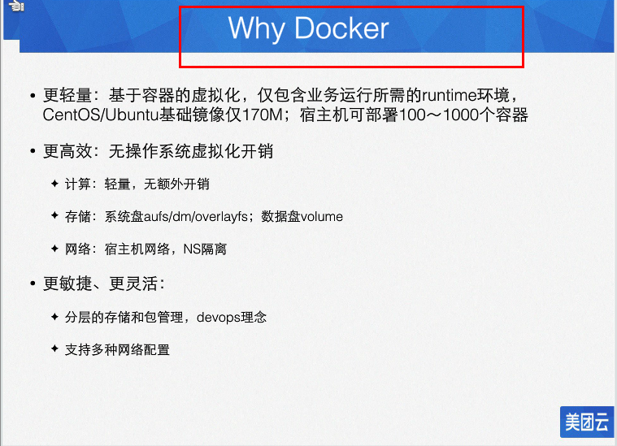 

    

##  4、下载

docker官网：http://www.docker.com

Docker Hub官网: https://hub.docker.com/

# 二、Docker安装

## 1、前提说明

1. Centos Docker安装

    

2. 目前，CentOS 仅发行版本中的内核支持 Docker。Docker 运行在CentOS 7 (64-bit)上，要求系统为64位、Linux系统内核版本为 3.8以上，这里选用Centos7.x

   查看自己的内核
   uname命令用于打印当前系统相关信息（内核版本号、硬件架构、主机名称和操作系统类型等）。

    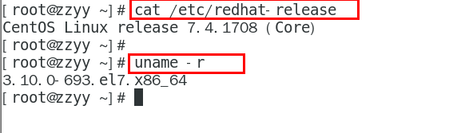 

## 2、Docker的基本组成

1. 镜像(image)

   Docker 镜像（Image）就是一个**只读**的模板。镜像可以用来创建 Docker 容器，**一个镜像可以创建很多容器**。
   它也相当于是一个root文件系统。比如官方镜像 centos 7 就包含了完整的一套 centos 7 最小系统的 root 文件系统。
   相当于容器的“源代码”，**docker镜像文件类似于Java的类，而docker容器实例类似于java中new出来的实例对象**。

    

2. 容器(container)

   - 从面向对象角度
     Docker 利用容器（Container）独立运行的一个或一组应用，应用程序或服务运行在容器里面，容器就类似于一个虚拟化的运行环境，**容器是用镜像创建的运行实例**。就像是Java中的类和实例对象一样，镜像是静态的定义，容器是镜像运行时的实体。容器为镜像提供了一个标准的和隔离的运行环境，它可以被启动、开始、停止、删除。每个容器都是相互隔离的、保证安全的平台
   - 从镜像容器角度
     **可以把容器看做是一个简易版的 Linux 环境**（包括root用户权限、进程空间、用户空间和网络空间等）和运行在其中的应用程序。

3. 仓库(repository)

   仓库（Repository）是**集中存放镜像文件的场所**。

   类似于Maven仓库，存放各种jar包的地方；github仓库，存放各种git项目的地方；Docker公司提供的官方registry被称为Docker Hub，存放各种镜像模板的地方。

   仓库分为公开仓库（Public）和私有仓库（Private）两种形式。
   **最大的公开仓库是 Docker Hub(https://hub.docker.com/)，**
   存放了数量庞大的镜像供用户下载。国内的公开仓库包括阿里云 、网易云等

小总结：

需要正确的理解仓库/镜像/容器这几个概念:
Docker 本身是一个容器运行载体或称之为管理引擎。我们把应用程序和配置依赖打包好形成一个可交付的运行环境，这个打包好的运行环境就是image镜像文件。只有通过这个镜像文件才能生成Docker容器实例(类似Java中new出来一个对象)。

image文件可以看作是容器的模板。Docker 根据 image 文件生成容器的实例。同一个 image 文件，可以生成多个同时运行的容器实例。

镜像文件

*  image 文件生成的容器实例，本身也是一个文件，称为镜像文件。

容器实例

*  一个容器运行一种服务，当我们需要的时候，就可以通过docker客户端创建一个对应的运行实例，也就是我们的容器

仓库

*  就是放一堆镜像的地方，我们可以把镜像发布到仓库中，需要的时候再从仓库中拉下来就可以了。

### 2-1、Docker平台架构图解(入门版)

 

docker的工作原理

Docker是一个Client-Server结构的系统，Docker守护进程运行在主机上， 然后通过Socket连接从客户端访问，守护进程从客户端接受命令并管理运行在主机上的容器。 容器，是一个运行时环境，就是我们前面说到的集装箱。可以对比mysql演示对比讲解


### 2-2、Docker平台架构图解(架构版)

整体架构及底层通信原理简述

- Docker 是一个 C/S 模式的架构，后端是一个松耦合架构，众多模块各司其职。

   

   

## 3、CentOS7安装Docker

安装地址：https://docs.docker.com/engine/install/centos/

1. 确定你是CentOS7及以上版本

   ```shell
   [root@localhost ~]# cat /etc/redhat-release
   CentOS Linux release 7.4.1708 (Core)
   ```

2. 卸载旧版本

   ```shell
   sudo yum remove docker \
                     docker-client \
                     docker-client-latest \
                     docker-common \
                     docker-latest \
                     docker-latest-logrotate \
                     docker-logrotate \
                     docker-engine
   ```

3. yum安装gcc相关

   > 确保能连接网络

   ```shell
   [root@localhost ~]# yum -y install gcc
   ...
   [root@localhost ~]# yum -y install gcc-c++
   ...
   ```

4. 安装需要的软件包

   ```shell
   [root@localhost ~]# yum install -y yum-utils
   ```

5. 设置stable镜像仓库

   大坑：由于官网的镜像仓库路径是外网路径，后面会经常出错

    

    正确的镜像仓库路径：http://mirrors.aliyun.com/docker-ce/linux/centos/docker-ce.repo

   ```shell
   [root@localhost ~]# yum-config-manager --add-repo http://mirrors.aliyun.com/docker-ce/linux/centos/docker-ce.repo
   ```

6. 更新yum软件包索引

   ```shell
   [root@localhost ~]# yum makecache fast
   ```

7. 安装DOCKER CE

   ```shell
   [root@localhost ~]# yum -y install docker-ce docker-ce-cli containerd.io
   ```

   执行结果：

    

8. 启动docker

   ```shell
   systemctl start docker
   ```

9. 测试

   ```shell
   [root@localhost ~]# docker version
   ```

     

   ```shell
   [root@localhost ~]# docker run hello-world
   ```

     

   如上代表docker运行正常！

10. 停止docker服务

    ```shell
    systemctl stop docker 
    ```

11. 卸载docker服务流程

    ```shell
    # 停止docker服务
    [root@localhost ~]# systemctl stop docker 
    
    [root@localhost ~]# yum remove docker-ce docker-ce-cli containerd.io
    
    [root@localhost ~]# rm -rf /var/lib/docker
    [root@localhost ~]# rm -rf /var/lib/containerd
    ```

## 4、阿里云镜像加速

官网：https://promotion.aliyun.com/ntms/act/kubernetes.html

1. 注册一个属于自己的阿里云账户(可复用淘宝账号)

2. 获得加速器地址连接

   1. 登陆阿里云开发者平台

   2. 点击右上控制台

   3. 选择容器镜像服务

       

   4. 获取加速器地址

       

3. 配置镜像加速器(方法1)

   > 推荐安装1.10.0以上版本的Docker客户端

   您可以通过修改daemon配置文件`/etc/docker/daemon.json`来使用加速器

   ```shell
   sudo mkdir -p /etc/docker
   sudo tee /etc/docker/daemon.json <<-'EOF'
   {
     "registry-mirrors": ["https://jaegpoww.mirror.aliyuncs.com"]
   }
   EOF
   sudo systemctl daemon-reload
   sudo systemctl restart docker
   ```

   ```shell
   [root@localhost ~]# mkdir -p /etc/docker
   [root@localhost ~]# tee /etc/docker/daemon.json <<-'EOF'
   > {
   >   "registry-mirrors": ["https://jaegpoww.mirror.aliyuncs.com"]
   > }
   > EOF
   {
     "registry-mirrors": ["https://jaegpoww.mirror.aliyuncs.com"]
   }
   [root@localhost ~]# sudo systemctl daemon-reload
   [root@localhost ~]# sudo systemctl restart docker
   ```

4. 配置镜像加速器(方法2)

   ```shell
   [root@localhost ~]# mkdir -p /etc/docker
   [root@localhost ~]# vim  /etc/docker/daemon.json
   {
     "registry-mirrors": ["https://｛自已的编码｝.mirror.aliyuncs.com"]
   }
   ```

## 5、docker hello-world解析

1. 启动Docker后台容器(测试运行 hello-world)

   ```shell
   [root@localhost ~]# docker run hello-world
   ```

    

2. run干了什么

     

## 6、为什么Docker会比VM虚拟机快

1. docker有着比虚拟机更少的抽象层
   由于docker不需要Hypervisor(虚拟机)实现硬件资源虚拟化,运行在docker容器上的程序直接使用的都是实际物理机的硬件资源。因此在CPU、内存利用率上docker将会在效率上有明显优势。
2. docker利用的是宿主机的内核,而不需要加载操作系统OS内核
   当新建一个容器时,docker不需要和虚拟机一样重新加载一个操作系统内核。进而避免引寻、加载操作系统内核返回等比较费时费资源的过程,当新建一个虚拟机时,虚拟机软件需要加载OS,返回新建过程是分钟级别的。而docker由于直接利用宿主机的操作系统,则省略了返回过程,因此新建一个docker容器只需要几秒钟。


# 三、Docker常用命令

## 1、帮助启动类命令

1. 启动docker

   ```shell
   [root@localhost ~]# systemctl start docker
   ```

2. 停止docker

   ```shell
   [root@localhost ~]# systemctl stop docker
   ```

3. 重启docker

   ```shell
   [root@localhost ~]# systemctl restart docker
   ```

4. 查看docker状态： systemctl status docker

   ```shell
   [root@localhost ~]# systemctl status docker
   ```

5. 开机启动： systemctl enable docker

   ```shell
   [root@localhost ~]# systemctl enable docker
   ```

6. 查看docker概要信息

   ```shell
   [root@localhost ~]# docker info
   ```

7. 查看docker总体帮助文档

   ```shell
   [root@localhost ~]# docker --help
   ```

8. 查看docker命令帮助文档：

   ```shell
   [root@localhost ~]# docker 具体命令 --help
   ```


docker命令套用：docker [OPTIONS] COMMAND

## 2、镜像命令

### 2-1、docker images 

> 功能：列出本地主机上的镜像

> docker images [OPTIONS]

```shell
[root@localhost ~]# docker images
REPOSITORY    TAG          IMAGE ID       CREATED         SIZE
hello-world   latest       feb5d9fea6a5   7 months ago    13.3kB
rabbitmq      management   246db2517862   11 months ago   186MB
```

各个选项说明:

- REPOSITORY：表示镜像的仓库源
- TAG：镜像的标签版本号
- IMAGE ID：镜像ID
- CREATED：镜像创建时间
- SIZE：镜像大小

同一仓库源可以有多个TAG版本，代表这个仓库源的不同个版本，我们使用 REPOSITORY:TAG 来定义不同的镜像。

如果你不指定一个镜像的版本标签，例如你只使用 ubuntu，docker 将默认使用 ubuntu:latest 镜像

OPTIONS说明：

- -a :列出本地所有的镜像（含历史映像层）

  ```shell
  [root@localhost ~]# docker images -a
  REPOSITORY    TAG          IMAGE ID       CREATED         SIZE
  hello-world   latest       feb5d9fea6a5   7 months ago    13.3kB
  rabbitmq      management   246db2517862   11 months ago   186MB
  ```

- -q :只显示镜像ID。

  ```shell
  [root@localhost ~]# docker images -q
  feb5d9fea6a5
  246db2517862
  ```

### 2-2、docker search

> 功能：镜像仓库查询镜像

镜像仓库：https://hub.docker.com

命令：

> docker search [OPTIONS] 镜像名字

```shell
[root@localhost ~]# docker search redis
NAME                                               DESCRIPTION                                     STARS     OFFICIAL   AUTOMATED
redis                                              Redis is an open source key-value store that…   10924     [OK]       
bitnami/redis                                      Bitnami Redis Docker Image                      217                  [OK]
bitnami/redis-sentinel                             Bitnami Docker Image for Redis Sentinel         36                   [OK]
bitnami/redis-cluster                                                                              31                   
circleci/redis                                     CircleCI images for Redis                       12                   [OK]
...
```

各个选项说明:

- NAME：镜像名称
- DESCRIPTION：镜像说明
- STARS：点赞数量
- OFFICIAL：是否是官方的
- AUTOMATED：是否是自动构建的

OPTIONS说明：

- --limit : 只列出N个镜像，默认25个

  ```shell
  [root@localhost ~]# docker search --limit 1 hello-world
  NAME          DESCRIPTION                                     STARS     OFFICIAL   AUTOMATED
  hello-world   Hello World! (an example of minimal Dockeriz…   1738      [OK]
  ```

### 2-3、docker pull

> 功能：下载镜像

> docker pull 镜像名字[:TAG]

没有TAG默认最新版 == docker pull 镜像名字:latest

```shell
[root@localhost ~]# docker pull redis
Using default tag: latest
latest: Pulling from library/redis
....
Digest: sha256:db485f2e245b5b3329fdc7eff4eb00f913e09d8feb9ca720788059fdc2ed8339
Status: Downloaded newer image for redis:latest
docker.io/library/redis:latest
[root@localhost ~]# docker images
REPOSITORY    TAG          IMAGE ID       CREATED         SIZE
redis         latest       7614ae9453d1   4 months ago    113MB
hello-world   latest       feb5d9fea6a5   7 months ago    13.3kB
rabbitmq      management   246db2517862   11 months ago   186MB
```

### 2-4、docker system df

> 功能：查看镜像/容器/数据卷所占的空间

```shell
[root@localhost ~]# docker system df
TYPE            TOTAL     ACTIVE    SIZE      RECLAIMABLE
Images          4         2         371.8MB   185.5MB (49%)
Containers      3         0         567B      567B (100%)
Local Volumes   2         1         507.7MB   0B (0%)
Build Cache     0         0         0B        0B
```

### 2-5、docker rmi

> 功能：删除镜像

- 删除单个

  > docker rmi -f 镜像ID

  ```shell
  [root@localhost ~]# docker rmi feb5d9fea6a5
  Error response from daemon: conflict: unable to delete feb5d9fea6a5 (must be forced) - image is being used by stopped container b0dfb628353c #镜像被容器使用中 需要-f强制删除
  [root@localhost ~]# docker rmi -f feb5d9fea6a5
  Untagged: hello-world:latest
  Untagged: hello-world@sha256:2498fce14358aa50ead0cc6c19990fc6ff866ce72aeb5546e1d59caac3d0d60f
  Deleted: sha256:feb5d9fea6a5e9606aa995e879d862b825965ba48de054caab5ef356dc6b3412
  [root@localhost ~]# docker images
  REPOSITORY   TAG          IMAGE ID       CREATED         SIZE
  redis        latest       7614ae9453d1   4 months ago    113MB
  ubuntu       latest       ba6acccedd29   7 months ago    72.8MB
  rabbitmq     management   246db2517862   11 months ago   186MB
  ```

- 删除多个

  > docker rmi -f 镜像ID1 镜像ID2...

  ```shell
  [root@localhost ~]# docker rmi -f feb5d9fea6a5 ba6acccedd29
  Untagged: hello-world:latest
  Untagged: hello-world@sha256:2498fce14358aa50ead0cc6c19990fc6ff866ce72aeb5546e1d59caac3d0d60f
  Deleted: sha256:feb5d9fea6a5e9606aa995e879d862b825965ba48de054caab5ef356dc6b3412
  Untagged: ubuntu:latest
  Untagged: ubuntu@sha256:626ffe58f6e7566e00254b638eb7e0f3b11d4da9675088f4781a50ae288f3322
  Deleted: sha256:ba6acccedd2923aee4c2acc6a23780b14ed4b8a5fa4e14e252a23b846df9b6c1
  Deleted: sha256:9f54eef412758095c8079ac465d494a2872e02e90bf1fb5f12a1641c0d1bb78b
  ```

- 删除全部

  > docker rmi -f $(docker images -qa)

  ```shell
  [root@localhost ~]# docker rmi -f $(docker images -qa)
  # $(docker images -qa)内获取到的所有镜像id
  ```

### 2-6、docker虚悬镜像

docker虚悬镜像：仓库名、标签都是<none>的镜像，俗称虚悬镜像dangling image

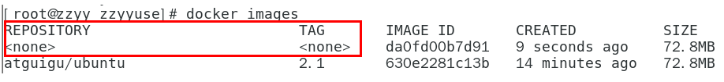

虚悬镜像建议删除，否则docker部署可能出问题

## 3、容器命令

`有镜像才能创建容器，这是根本前提(下载一个CentOS或者ubuntu镜像演示)`


```shell
[root@localhost ~]# docker pull centos 
/
[root@localhost ~]# docker pull ubuntu
```

ubuntu比较小，本次演示用ubuntu演示

### 1、新建+启动容器

> docker run [OPTIONS] `IMAGE` [COMMAND] [ARG...]

OPTIONS说明（常用）：有些是一个减号，有些是两个减号

- --name="容器新名字"：为容器指定一个名称；

- -d: 后台运行容器并返回容器ID，也即启动守护式容器(后台运行)；

- `-i：以交互模式运行容器，通常与 -t 同时使用；`

- `-t：为容器重新分配一个伪输入终端，通常与 -i 同时使用；也即启动交互式容器(前台有伪终端，等待交互)；`

- -P: `随机`端口映射，大写P

- -p: `指定`端口映射，小写p

   

启动交互式容器(前台命令行)

```shell
# 使用镜像ubuntu:latest以交互模式启动一个容器,在容器内执行/bin/bash命令。
[root@localhost ~]# docker run -it ubuntu /bin/bash
root@413096c04b0a:/# 
```

参数说明：

- -i: 交互式操作。
- -t: 终端。
- ubuntu: ubuntu镜像。
- /bin/bash：放在镜像名后的是命令，这里我们希望有个交互式 Shell，因此用的是 /bin/bash。
  要退出终端，直接输入 exit:

- 

### 2、列出当前所有正在运行的容器

>  docker ps [OPTIONS]

```shell
[root@localhost ~]# docker ps
CONTAINER ID   IMAGE     COMMAND       CREATED         STATUS         PORTS     NAMES
413096c04b0a   ubuntu    "/bin/bash"   5 minutes ago   Up 5 minutes             hopeful_mayer
```

再启动一个终端,启动一个容器并指定容器名称：

```shell
[root@localhost ~]# docker run -it --name=myu01 ubuntu bash
root@066f37b889de:/# 
```

查看正常运行的容器：

```shell
[root@localhost ~]# docker ps
CONTAINER ID   IMAGE     COMMAND       CREATED          STATUS          PORTS     NAMES
066f37b889de   ubuntu    "bash"        31 seconds ago   Up 30 seconds             myu01
413096c04b0a   ubuntu    "/bin/bash"   8 minutes ago    Up 8 minutes              hopeful_mayer
```

OPTIONS说明（常用）：

- -a :列出当前所有**正在运行**的容器+**历史上运行过**的

  ```shell
  [root@localhost ~]# docker ps -a
  CONTAINER ID   IMAGE         COMMAND       CREATED          STATUS                      PORTS     NAMES
  066f37b889de   ubuntu        "bash"        2 minutes ago    Up 2 minutes                          myu01
  413096c04b0a   ubuntu        "/bin/bash"   10 minutes ago   Exited (0) 13 seconds ago             hopeful_mayer
  2cb88e07b8e8   hello-world   "/hello"      3 days ago       Exited (0) 3 days ago                 optimistic_hertz
  47fce1b3b8ae   hello-world   "/hello"      3 days ago       Exited (0) 3 days ago                 compassionate_nightingale
  ```

- -l :显示最近创建的一个容器。

  ```shell
  [root@localhost ~]# docker ps -l
  CONTAINER ID   IMAGE     COMMAND   CREATED         STATUS         PORTS     NAMES
  066f37b889de   ubuntu    "bash"    3 minutes ago   Up 3 minutes             myu01
  ```

- -n：显示最近n个创建的容器。

  ```shell
  [root@localhost ~]# docker ps -n 2
  CONTAINER ID   IMAGE     COMMAND       CREATED         STATUS         PORTS     NAMES
  292fdc8c4a43   ubuntu    "/bin/bash"   2 minutes ago   Up 2 minutes             trusting_gould
  066f37b889de   ubuntu    "bash"        7 minutes ago   Up 7 minutes             myu01
  ```

- **-q :静默模式，只显示容器编号。**

  ```shell
  [root@localhost ~]# docker ps -q
  292fdc8c4a43
  066f37b889de
  ```

### 3、退出容器

两种退出方式：

- exit：run进去容器，exit退出，容器停止

  ```shell
  # 启动两个容器
  [root@localhost ~]# docker ps
  CONTAINER ID   IMAGE     COMMAND       CREATED          STATUS          PORTS     NAMES
  ed78bf298177   ubuntu    "/bin/bash"   17 seconds ago   Up 17 seconds             festive_chandrasekhar
  d5bf83ad5c63   ubuntu    "/bin/bash"   28 seconds ago   Up 28 seconds             pedantic_pasteur
  root@ed78bf298177:/# exit
  exit
  [root@localhost ~]# docker ps
  CONTAINER ID   IMAGE     COMMAND       CREATED         STATUS         PORTS     NAMES
  d5bf83ad5c63   ubuntu    "/bin/bash"   2 minutes ago   Up 2 minutes             pedantic_pasteur
  ```

- ctrl+p+q：run进去容器，ctrl+p+q退出，`容器不停止`

### 4、启动已停止运行的容器

> docker start 容器ID或者容器名

```shell
[root@localhost ~]# docker start ed78bf298177
ed78bf298177
[root@localhost ~]# docker ps
CONTAINER ID   IMAGE     COMMAND       CREATED         STATUS         PORTS     NAMES
ed78bf298177   ubuntu    "/bin/bash"   7 minutes ago   Up 6 seconds             festive_chandrasekhar
d5bf83ad5c63   ubuntu    "/bin/bash"   7 minutes ago   Up 7 minutes             pedantic_pasteur
```

### 5、进入正在运行的容器

> docker exec -it 容器名或id /bin/bash

```shell
[root@localhost ~]# docker exec -it d5bf83ad5c63 /bin/bash
root@d5bf83ad5c63:/# 
```

### 6、重启容器

> docker restart 容器ID或者容器名

### 7、停止容器

> docker stop 容器ID或者容器名

### 8、强制停止容器

> docker kill 容器ID或容器名

### 9、删除已停止的容器

> docker rm [-f] 容器ID

-f：强制删除

- `一次性删除多个容器实例`

  > docker rm -f $(docker ps -a -q)

  > docker ps -a -q | xargs docker rm

### 10、重要指令

> 有镜像才能创建容器，这是根本前提(下载一个Redis6.0.8镜像演示)

#### 10-1、启动守护式容器(后台服务器)

`在大部分的场景下，我们希望 docker 的服务是在后台运行的，我们可以过 -d 指定容器的后台运行模式。`

> docker run -d 容器名

```shell
#使用镜像ubuntu:latest以后台模式启动一个容器
docker run -d ubuntu
[root@localhost ~]# docker run -d ubuntu
d6535376e760cb6d113cdb6007b77894551f5b8f484212b2e154af684301205a
[root@localhost ~]# docker ps -a
CONTAINER ID   IMAGE                 COMMAND                  CREATED             STATUS                         PORTS      NAMES
d6535376e760   ubuntu                "bash"                   30 seconds ago      Exited (0) 29 seconds ago                 ecstatic_banach
```

问题：然后docker ps -a 进行查看, 会发现容器已经退出

很重要的要说明的一点: `Docker容器后台运行,就必须有一个前台进程`.容器运行的命令如果不是那些一直挂起的命令（比如运行top，tail），就是会自动退出的。

这个是docker的机制问题,比如你的web容器,我们以nginx为例，正常情况下,我们配置启动服务只需要启动响应的service即可。例如service nginx start但是,这样做,nginx为后台进程模式运行,就导致docker前台没有运行的应用,这样的容器后台启动后,会立即自杀因为他觉得他没事可做了.所以，最佳的解决方案是,`将你要运行的程序以前台进程的形式运行，常见就是命令行模式，表示我还有交互操作`

redis 前后台启动演示case

- 前台交互式启动

   

- 后台守护式启动

  ```shell
  [root@localhost ~]# docker run -d redis:6.0.8
  5e954a955149517ae9d5d21b8f527e0e7fff9a583cfc743ce6b290c6d0f2f68d
  [root@localhost ~]# docker ps
  CONTAINER ID   IMAGE         COMMAND                  CREATED          STATUS          PORTS      NAMES
  5e954a955149   redis:6.0.8   "docker-entrypoint.s…"   3 seconds ago    Up 2 seconds    6379/tcp   compassionate_shockley
  7db84571e936   redis:6.0.8   "docker-entrypoint.s…"   56 seconds ago   Up 55 seconds   6379/tcp   suspicious_faraday
  ```

#### 10-2、查看容器日志

> docker logs 容器ID

```shell
[root@localhost ~]# docker logs 5e954a955149
1:C 16 May 2022 04:30:41.141 # oO0OoO0OoO0Oo Redis is starting oO0OoO0OoO0Oo
1:C 16 May 2022 04:30:41.141 # Redis version=6.0.8, bits=64, commit=00000000, modified=0, pid=1, just started
1:C 16 May 2022 04:30:41.141 # Warning: no config file specified, using the default config. In order to specify a config file use redis-server /path/to/redis.conf
1:M 16 May 2022 04:30:41.143 * Running mode=standalone, port=6379.
1:M 16 May 2022 04:30:41.143 # WARNING: The TCP backlog setting of 511 cannot be enforced because /proc/sys/net/core/somaxconn is set to the lower value of 128.
```

#### 10-3、查看容器内运行的进程

> docker top 容器ID

```shell
[root@localhost ~]# docker top 5e954a955149
UID                 PID                 PPID                C                   STIME               TTY                 TIME                
polkitd             5506                5488                0                   12:30               ?                 00:00:00 

CMD

redis-server *:6379
```

#### 10-4、查看容器内部细节

> docker inspect 容器ID

#### 10-5、`进入正在运行的容器并以命令行交互`

> docker exec -it 容器ID /bin/bash

```shell
[root@localhost ~]# docker exec -it 5e954a955149 /bin/bash
root@5e954a955149:/data#
```

> docker attach 容器ID：重新进入

```shell
[root@localhost ~]# docker attach 7eb34795d9b4
root@7eb34795d9b4:/# 
```

上述两个区别

- attach 直接进入容器启动命令的终端，不会启动新的进程。`用exit退出，会导致容器的停止`
- exec 是在容器中打开新的终端，并且可以启动新的进程。`用exit退出，不会导致容器的停止`

推荐大家使用 docker exec 命令，因为退出容器终端，不会导致容器的停止。

用之前的redis容器实例进入试试,进入redis服务

- `docker exec -it 容器ID /bin/bash`

  ```shell
  [root@localhost ~]# docker ps
  CONTAINER ID   IMAGE         COMMAND                  CREATED         STATUS        PORTS      NAMES
  8e7a46b7c9a9   redis:6.0.8   "docker-entrypoint.s…"   2 seconds ago   Up 1 second   6379/tcp   compassionate_diffie
  [root@localhost ~]# docker exec -it 8e7a46b7c9a9 /bin/bash
  root@8e7a46b7c9a9:/data#
  ```

- `docker exec -it 容器ID redis-cli`

  ```shell
  [root@localhost ~]# docker ps
  CONTAINER ID   IMAGE         COMMAND                  CREATED              STATUS              PORTS      NAMES
  8e7a46b7c9a9   redis:6.0.8   "docker-entrypoint.s…"   About a minute ago   Up About a minute   6379/tcp   compassionate_diffie
  [root@localhost ~]# docker exec -it 8e7a46b7c9a9 redis-cli
  127.0.0.1:6379> 
  ```

`一般用-d后台启动的程序，再用exec进入对应容器实例`

#### 10-6、从容器内拷贝文件到主机上

有时容器需要被删除前，将文件拷贝到主机上

> docker cp  容器ID:容器内路径 目的主机路径

```shell
root@f6a363b4fe2f:/test# touch a.txt
root@f6a363b4fe2f:/test# ls
a.txt

[root@localhost ~]# docker cp f6a363b4fe2f:/test/a.txt /test/
[root@localhost ~]# cd /test
[root@localhost test]# ls
a.txt
```

#### 10-7、导入和导出容器

> export 导出容器的内容留作为一个tar归档文件[对应import命令]
>
> import 从tar包中的内容创建一个新的文件系统再导入为镜像[对应export]
>

案例：

> docker export 容器ID > 文件名.tar

```shell
[root@localhost ~]# docker ps
CONTAINER ID   IMAGE         COMMAND                  CREATED             STATUS             PORTS      NAMES
f6a363b4fe2f   ubuntu        "/bin/bash"              About an hour ago   Up About an hour              admiring_albattani
8e7a46b7c9a9   redis:6.0.8   "docker-entrypoint.s…"   About an hour ago   Up About an hour   6379/tcp   compassionate_diffie
[root@localhost ~]# docker export f6a363b4fe2f > abcd.tar
[root@localhost ~]# ls
abcd.tar         appendonly.aof  dump.rdb              公共  视频  文档  音乐
anaconda-ks.cfg  dump6379.rdb    initial-setup-ks.cfg  模板  图片  下载  桌面
```

> cat 文件名.tar | docker import - 镜像用户/镜像名:镜像版本号

```shell
[root@localhost test]# cat abcd.tar | docker import - geek/ubuntu:lastest
sha256:0e6cd5cb2cb07ca5a85f51c94bcde0ab547f91e62df4acc97ef6e95bfd87ffd9
[root@localhost test]# docker images
REPOSITORY    TAG          IMAGE ID       CREATED          SIZE
geek/ubuntu   lastest      0e6cd5cb2cb0   25 seconds ago   72.8MB
redis         latest       7614ae9453d1   4 months ago     113MB
ubuntu        latest       ba6acccedd29   7 months ago     72.8MB
[root@localhost test]# docker run -it 0e6cd5cb2cb0 /bin/bash
root@7903531596a3:/# cd test
root@7903531596a3:/test# ls
a.txt
```

# 四、Docker镜像

## 1、镜像

### 1-1、镜像的概念

> 镜像是一种轻量级、可执行的独立软件包，它包含运行某个软件所需的所有内容，我们把应用程序和配置依赖打包好形成一个可交付的运行环境(包括代码、运行时需要的库、环境变量和配置文件等)，这个打包好的运行环境就是image镜像文件。
>
> 只有通过这个镜像文件才能生成Docker容器实例(类似Java中new出来一个对象)。

### 1-2、分层的镜像

> 以我们的pull为例，在下载的过程中我们可以看到docker的镜像好像是在一层一层的在下载
>

 

### 1-3、UnionFS（联合文件系统）

UnionFS（联合文件系统）：Union文件系统（UnionFS）是一种分层、轻量级并且高性能的文件系统，它支持`对文件系统的修改作为一次提交来一层层的叠加`，同时可以将不同目录挂载到同一个虚拟文件系统下(unite several directories into a single virtual filesystem)。Union 文件系统是 Docker 镜像的基础。`镜像可以通过分层来进行继承`，基于基础镜像（没有父镜像），可以制作各种具体的应用镜像。

特性：一次同时加载多个文件系统，但从外面看起来，只能看到一个文件系统，联合加载会把各层文件系统叠加起来，这样最终的文件系统会包含所有底层的文件和目录

### 1-4、Docker镜像加载原理

docker的镜像实际上由一层一层的文件系统组成，这种层级的文件系统UnionFS。
bootfs(boot file system)主要包含bootloader和kernel, bootloader主要是引导加载kernel, Linux刚启动时会加载bootfs文件系统，`在Docker镜像的最底层是引导文件系统bootfs`。这一层与我们典型的Linux/Unix系统是一样的，包含boot加载器和内核。当boot加载完成之后整个内核就都在内存中了，此时内存的使用权已由bootfs转交给内核，此时系统也会卸载bootfs。

rootfs (root file system) ，在bootfs之上。包含的就是典型 Linux 系统中的 /dev, /proc, /bin, /etc 等标准目录和文件。rootfs就是各种不同的操作系统发行版，比如Ubuntu，Centos等等。 

 

> 平时我们安装进虚拟机的CentOS都是好几个G，为什么docker这里才200M？？

对于一个精简的OS，rootfs可以很小，只需要包括最基本的命令、工具和程序库就可以了，因为底层直接用Host的kernel，自己只需要提供 rootfs 就行了。由此可见对于不同的linux发行版, bootfs基本是一致的, rootfs会有差别, 因此不同的发行版可以公用bootfs。

### 1-5、为什么 Docker 镜像要采用这种分层结构

镜像分层最大的一个好处就是共享资源，方便复制迁移，就是为了**复用**。

比如说有多个镜像都从相同的 base 镜像构建而来，那么 Docker Host 只需在磁盘上保存一份 base 镜像；
同时内存中也只需加载一份 base 镜像，就可以为所有容器服务了。而且镜像的每一层都可以被共享。

## 2、重点理解

> `Docker镜像层都是只读的，容器层是可写的`

当容器启动时，一个新的可写层被加载到镜像的顶部。这一层通常被称作“容器层”，“容器层”之下的都叫“镜像层”。

所有对容器的改动 - 无论添加、删除、还是修改文件都只会发生在容器层中。只有容器层是可写的，容器层下面的所有镜像层都是只读的。

 

## 3、Docker镜像commit操作案例

`docker commit提交容器副本使之成为一个新的镜像`

> docker commit -m="提交的描述信息" -a="作者" 容器ID 要创建的目标镜像名:[标签名]

案例演示ubuntu安装vim

1. 从Hub上下载ubuntu镜像到本地并成功运行

2. `原始的默认Ubuntu镜像是不带着vim命令的`

   ```shell
   root@96a782ba963c:/# vim a.txt
   bash: vim: command not found
   ```

3. 外网连通的情况下，安装vim

   ```shell
   #更新包管理工具
   root@96a782ba963c:/# apt-get update
   ...
   Fetched 22.1 MB in 11s (1976 kB/s)                                                                                           
   Reading package lists... Done
   # 安装vim
   root@96a782ba963c:/# apt-get -y install vim
   ...
   root@96a782ba963c:/# vim a.txt
   ```

4. 安装完成后，commit我们自己的新镜像

   ```shell
   [root@localhost ~]# docker commit -m="add vim cmd" -a="lambert" 96a782ba963c geek/myubuntu:1.1
   sha256:f304cdbd6b63d517fb73c684dd3aabff3c3cef28a8efef8a2684102efde267cc
   [root@localhost ~]# docker images
   REPOSITORY      TAG          IMAGE ID       CREATED          SIZE
   geek/myubuntu   1.1          f304cdbd6b63   16 seconds ago   176MB
   ubuntu          latest       ba6acccedd29   7 months ago     72.8MB
   ```

5. 启动我们的新镜像并和原来的对比

   ```shell
   [root@localhost ~]# docker run -it ubuntu /bin/bash
   root@7505f7a04ea4:/# ls
   bin  boot  dev  etc  home  lib  lib32  lib64  libx32  media  mnt  opt  proc  root  run  sbin  srv  sys  tmp  usr  var
   root@7505f7a04ea4:/# vim a.txt
   bash: vim: command not found
   root@7505f7a04ea4:/# exit
   exit
   [root@localhost ~]# docker run -it f304cdbd6b63 /bin/bash
   root@b84c4a94a1db:/# ls
   a.txt  bin  boot  dev  etc  home  lib  lib32  lib64  libx32  media  mnt  opt  proc  root  run  sbin  srv  sys  tmp  usr  var
   root@b84c4a94a1db:/# vim a.txt
   ```

## 4、小总结

Docker中的镜像分层，`支持通过扩展现有镜像，创建新的镜像`。类似Java继承于一个Base基础类，自己再按需扩展。
新镜像是从 base 镜像一层一层叠加生成的。每安装一个软件，就在现有镜像的基础上增加一层


# 五、本地镜像发布到阿里云

## 1、本地镜像发布到阿里云流程

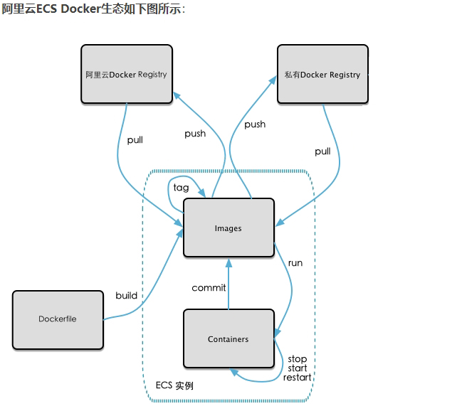

## 2、镜像的生成方法

> 基于当前容器创建一个新的镜像，新功能增强
> docker commit [OPTIONS] 容器ID [REPOSITORY[:TAG]]

后面的DockerFile章节，第2种方法

## 3、将本地镜像推送到阿里云

### 3-1、本地镜像素材原型

 

### 3-2、阿里云开发者平台

https://promotion.aliyun.com/ntms/act/kubernetes.html

### 3-3、创建仓库镜像

1. 选择右上角控制台，进入容器镜像服务

2. 选择个人实例（没有可以新建一个）

    

3. 新建命名空间

    

4. 新建镜像仓库

    

    

5. 进入管理界面获得脚本命令

    

## 4、将镜像推送到阿里云registry

> 管理界面脚本

 

> 脚本实例(这里选择上面的第三条脚本实例)

```shell
[root@localhost test]# docker login --username=lambert班 registry.cn-hangzhou.aliyuncs.com
Password: 
WARNING! Your password will be stored unencrypted in /root/.docker/config.json.
Configure a credential helper to remove this warning. See
https://docs.docker.com/engine/reference/commandline/login/#credentials-store

Login Succeeded
[root@localhost test]# docker tag f304cdbd6b63 registry.cn-hangzhou.aliyuncs.com/lam_dockerstudy/myubuntu:1.1
[root@localhost test]# docker push registry.cn-hangzhou.aliyuncs.com/lam_dockerstudy/myubuntu:1.1
The push refers to repository [registry.cn-hangzhou.aliyuncs.com/lam_dockerstudy/myubuntu]
747dcca8bea3: Pushed 
9f54eef41275: Pushed 
1.1: digest: sha256:c09165519445a5f62c8e0f72a63d68f2c4e4ac8ed83e174399c7af247e3ef023 size: 741
```

> 远程库：

 

## 5、将阿里云上的镜像下载到本地

```shell
#先删除本地的镜像后再拉取镜像
[root@localhost test]# docker pull registry.cn-hangzhou.aliyuncs.com/lam_dockerstudy/myubuntu:1.1
1.1: Pulling from lam_dockerstudy/myubuntu
7b1a6ab2e44d: Already exists 
73a8c64ac8c7: Already exists 
Digest: sha256:c09165519445a5f62c8e0f72a63d68f2c4e4ac8ed83e174399c7af247e3ef023
Status: Downloaded newer image for registry.cn-hangzhou.aliyuncs.com/lam_dockerstudy/myubuntu:1.1
registry.cn-hangzhou.aliyuncs.com/lam_dockerstudy/myubuntu:1.1
[root@localhost test]# docker images
REPOSITORY                                                   TAG          IMAGE ID       CREATED          SIZE
registry.cn-hangzhou.aliyuncs.com/lam_dockerstudy/myubuntu   1.1          f304cdbd6b63   45 minutes ago   176M
```

# 六、本地镜像发布到私有库

## 1、本地镜像发布到私有库流程

 

## 2、是什么

1. 官方Docker Hub地址：https://hub.docker.com/，中国大陆访问太慢了且准备被阿里云取代的趋势，不太主流。
2. Dockerhub、阿里云这样的公共镜像仓库可能不太方便，涉及机密的公司不可能提供镜像给公网，所以需要创建一个本地私人仓库供给团队使用，基于公司内部项目构建镜像。

    Docker Registry是官方提供的工具，可以用于构建私有镜像仓库

## 3、将本地镜像推送到私有库

1. 下载镜像Docker Registry

   ```shell
   [root@localhost ~]# docker pull registry
   [root@localhost ~]# docker images
   REPOSITORY                                                   TAG          IMAGE ID       CREATED         SIZE
   registry.cn-hangzhou.aliyuncs.com/lam_dockerstudy/myubuntu   1.1          f304cdbd6b63   14 hours ago    176MB
   registry                                                     latest       b8604a3fe854   6 months ago    26.2MB
   ```

2. 运行私有库Registry，相当于本地有个私有Docker hub

   ```shell
   [root@localhost ~]# docker run -d -p 5000:5000  -v /zzyyuse/myregistry/:/tmp/registry --privileged=true registry
   [root@localhost ~]# docker ps
   CONTAINER ID   IMAGE      COMMAND                  CREATED         STATUS         PORTS                                       NAMES
   f85c4ec942e8   registry   "/entrypoint.sh /etc…"   5 seconds ago   Up 3 seconds   0.0.0.0:5000->5000/tcp, :::5000->5000/tcp   inspiring_lichterman
   ```

   > 默认情况，仓库被创建在容器的/var/lib/registry目录下，建议自行用容器卷映射(上是/zzyyuse/myregistry/)，方便于宿主机联调

3. 案例演示创建一个新镜像，ubuntu安装ifconfig命令

   1. 从Hub上下载ubuntu镜像到本地并成功运行

   2. 原始的Ubuntu镜像是不带着ifconfig命令的

      ```shell
      root@7505f7a04ea4:/# ifconfig
      bash: ifconfig: command not found
      ```

   3. 外网连通的情况下，安装ifconfig命令并测试通过

      ```shell
      root@7505f7a04ea4:/# apt-get update
      root@7505f7a04ea4:/# apt-get install net-tools
      root@7505f7a04ea4:/# ifconfig
      eth0: flags=4163<UP,BROADCAST,RUNNING,MULTICAST>  mtu 1500
              inet 172.17.0.3  netmask 255.255.0.0  broadcast 172.17.255.255
              .....
      ```

   4. 安装完成后，commit我们自己的新镜像

      ```shell
      [root@localhost ~]# docker commit -m="add net-tools" -a="lambert" 7505f7a04ea4 mybuntu-ifconfig:1.2
      sha256:47bfe84e0d9061a38eae95813c5779aa78a450758b23fbef4c5808d111ad6bcf
      ```

   5. 启动我们的新镜像

      ```shell
      [root@localhost ~]# docker run -it 47bfe84e0d90 /bin/bash
      root@a27c47f23172:/# ifconfig
      eth0: flags=4163<UP,BROADCAST,RUNNING,MULTICAST>  mtu 1500
              inet 172.17.0.4  netmask 255.255.0.0  broadcast 172.17.255.255
              ......
      ```

4. curl验证私服库上有什么镜像

   ```shell
   [root@localhost ~]# curl -XGET http://10.1.53.169:5000/v2/_catalog
   {"repositories":[]}
   ```

5. 将新镜像mybuntu-ifconfig:1.2修改符合私服规范的Tag

   使用命令 docker tag 将mybuntu-ifconfig:1.2 这个镜像修改为10.1.53.169:5000/mybuntu-ifconfig:1.2

   > docker tag 镜像:Tag Host:Port/Repository:Tag

   ```shell
   [root@localhost ~]# docker tag mybuntu-ifconfig:1.2 10.1.53.169:5000/mybuntu-ifconfig:1.2
   ```

6. 修改配置文件使之支持http

   ```shell
   [root@localhost ~]# vim /etc/docker/daemon.json
   {
     "registry-mirrors": ["https://aa25jngu.mirror.aliyuncs.com"],
     "insecure-registries": ["10.1.53.169:5000"]
   }
   ```

   docker默认不允许http方式推送镜像，通过配置选项来取消这个限制。====> 修改完后如果不生效，建议重启docker

7. push推送到私服库

   ```shell
   [root@localhost ~]# docker push 10.1.53.169:5000/mybuntu-ifconfig:1.2
   The push refers to repository [10.1.53.169:5000/mybuntu-ifconfig]
   dad7c5880432: Pushed 
   9f54eef41275: Pushed 
   1.2: digest: sha256:648f79cb972834171ad293a33a3d4c54e534a4f86a1cc0e66e247d3f7ed0713e size: 741
   ```

8. 再次curl验证私服库上有什么镜像

   ```shell
   [root@localhost ~]# curl -XGET http://10.1.53.169:5000/v2/_catalog
   {"repositories":["mybuntu-ifconfig"]}
   ```

9. pull到本地并运行

   先删除10.1.53.169:5000/mybuntu-ifconfig镜像

   ```shell
   [root@localhost ~]# docker pull 10.1.53.169:5000/mybuntu-ifconfig:1.2
   1.2: Pulling from mybuntu-ifconfig
   Digest: sha256:648f79cb972834171ad293a33a3d4c54e534a4f86a1cc0e66e247d3f7ed0713e
   Status: Downloaded newer image for 10.1.53.169:5000/mybuntu-ifconfig:1.2
   10.1.53.169:5000/mybuntu-ifconfig:1.2
   [root@localhost ~]# docker images
   REPOSITORY                                                   TAG          IMAGE ID       CREATED         SIZE
   10.1.53.169:5000/mybuntu-ifconfig                            1.2          47bfe84e0d90   4 hours ago     110MB
   [root@localhost ~]# docker run -it 47bfe84e0d90 /bin/bash
   root@bc63f8bc31d2:/#ifconfig
   eth0: flags=4163<UP,BROADCAST,RUNNING,MULTICAST>  mtu 1500
           ....
   ```

# 七、Docker容器数据卷

> 前提设置

Docker挂载主机目录访问`如果出现cannot open directory .: Permission denied`

解决办法：在挂载目录后多加一个`--privileged=true`参数即可

如果是CentOS7安全模块会比之前系统版本加强，不安全的会先禁止，所以目录挂载的情况被默认为不安全的行为，
在SELinux里面挂载目录被禁止掉了额，如果要开启，我们一般使用--privileged=true命令，扩大容器的权限解决挂载目录没有权限的问题，也即
使用该参数，container内的root拥有真正的root权限，否则，container内的root只是外部的一个普通用户权限。

## 1、回顾下上一讲的知识点，参数V


-v /zzyyuse/myregistry/ : /tmp/registry/:第一个是宿主机的目录，第二个是容器内的目录，完成宿主机和容器内目录的备份与持久化

## 2、容器数据卷是什么

卷就是目录或文件，存在于一个或多个容器中，由docker挂载到容器，但不属于联合文件系统，因此能够绕过Union File System提供一些用于持续存储或共享数据的特性：
卷的设计目的就是`数据的持久化`，完全独立于容器的生存周期，因此Docker不会在容器删除时删除其挂载的数据卷

> 一句话：有点类似我们Redis里面的rdb和aof文件

> 将docker容器内的数据保存进宿主机的磁盘中

> 运行一个带有容器卷存储功能的容器实例

```shell
 docker run -it --privileged=true -v /宿主机绝对路径目录:/容器内目录 镜像名
```

## 3、容器数据卷能干嘛

将运用与运行的环境打包镜像，run后形成容器实例运行 ，但是我们对数据的要求希望是`持久化`的

Docker容器产生的数据，如果不备份，那么当容器实例删除后，容器内的数据自然也就没有了。为了能保存数据在docker中我们使用卷。

特点：

1. 数据卷可在容器之间共享或重用数据
2. 卷中的更改可以直接实时生效
3. 数据卷中的更改不会包含在镜像的更新中
4. 数据卷的生命周期一直持续到没有容器使用它为止

## 4、数据卷案例

### 4-1、宿主和容器之间映射添加容器卷

```shell
[root@localhost ~]#  docker run -it --privileged=true -v /tmp/host_data:/tmp/docker_data --name=u1 ubuntu
root@971e934e8a5f:/# cd /tmp/docker_data
root@971e934e8a5f:/tmp/docker_data# 
```

1. 查看数据卷是否挂载成功

   > docker inspect 容器ID

    

2. 在容器卷内新建数据

   ```shell
   root@971e934e8a5f:/tmp/docker_data# touch dockerin.txt
   root@971e934e8a5f:/tmp/docker_data# ls
   dockerin.txt
   ```

3. 宿主机映射的文件夹

   ```shell
   [root@localhost myregistry]# cd /tmp/host_data
   [root@localhost host_data]# ls
   dockerin.txt
   ```

4. 宿主机修改

   ```shell
   [root@localhost host_data]# touch hostin.txt
   ```

5. 查看容器卷内

   ```shell
   root@971e934e8a5f:/tmp/docker_data# ls
   dockerin.txt  hostin.txt
   ```

docker修改，主机同步获得 
主机修改，docker同步获得
docker容器stop，主机修改，docker容器重启数据同步获得。

### 4-2、读写规则映射添加说明

1. 读写(默认)

   >  docker run -it --privileged=true -v /宿主机绝对路径目录:/容器内目录:rw 镜像名

   默认同上面的案例，默认就是rw

2. 只读：容器实例内部被限制，只能读取不能写

   >  docker run -it --privileged=true -v /宿主机绝对路径目录:/容器内目录:ro 镜像名

   ```shell
   [root@localhost ~]# docker run -it --privileged=true -v /tmp/host_read-only_file:/tmp/docker_read-only_file:ro ubuntu
   root@54339c7c3385:/# cd tmp
   root@54339c7c3385:/tmp# ls
   docker_read-only_file
   root@54339c7c3385:/tmp# cd docker_read-only_file
   root@54339c7c3385:/tmp/docker_read-only_file# touch a.txt
   touch: cannot touch 'a.txt': Read-only file system
   ```

   ro = read only

   此时如果宿主机写入内容，可以同步给容器内，容器可以读取到。

### 4-3、卷的继承和共享

1. 容器2完成和宿主机的映射

   ```shell
   #容器
   [root@localhost host_data]# docker run -it --privileged=true -v /mydocker/u:/tmp/u --name u2 ubuntu
   root@5f8b2037b56a:/# cd /tmp/u
   root@5f8b2037b56a:/tmp/u# touch u2data.txt
   
   #宿主机
   [root@localhost ~]# cd /mydocker/u
   [root@localhost u]# ls
   u2data.txt
   ```

2. 容器3继承容器2的卷规则

   > docker run -it  --privileged=true `--volumes-from` 父类  --name u2 ubuntu

   ```shell
   #运行容器3 继承容器2的卷规则
   [root@localhost u]# docker run -it  --privileged=true --volumes-from u2  --name u3 ubuntu
   root@111ce205b112:/# cd /tmp/u
   root@111ce205b112:/tmp/u# ls
   u2data.txt
   #容器3中目录新建文件
   root@111ce205b112:/tmp/u# touch u3data.txt
   root@111ce205b112:/tmp/u# ls
   u2data.txt  u3data.txt
   #宿主机同步目录
   [root@localhost ~]# cd /mydocker/u
   [root@localhost u]# ls
   u2data.txt  u3data.txt
   ```

   > 容器3继承的是规则，并不是容器2，就算容器2挂了，容器3照样能正常同步宿主机的目录

# 八、Docker常规安装简介

## 1、总体步骤

1. 搜索镜像
2. 拉取镜像
3. 查看镜像
4. 启动镜像（服务端口映射）
5. 停止容器
6. 移除容器

## 2、安装tomcat

1. dockerhub(https://hub.docker.com/)上面查找tomcat镜像

   或

   ```shell
   docker search tomcat
   ```

2. 从docker hub上拉取tomcat镜像到本地

   ```shell
   [root@localhost u]# docker pull tomcat
   Using default tag: latest
   latest: Pulling from library/tomcat
   ....
   ```

3. docker images查看是否有拉取到的tomcat

   ```shell
   [root@localhost u]# docker images tomcat
   REPOSITORY   TAG       IMAGE ID       CREATED        SIZE
   tomcat       latest    fb5657adc892   4 months ago   680MB
   ```

4. 使用tomcat镜像创建容器实例(也叫运行镜像)

   ```shell
   [root@localhost u]# docker run -it -p 8080:8080 tomcat
   ```

   - -p 小写，主机端口:docker容器端口

   - -P 大写，随机分配端口

     

   - i:交互式启动

   - t:终端

   - d:后台

5. 访问猫首页

   > 若404未找到，有可能需要给8080端口开放防火墙或者可能没有映射端口
   >
   > 或者需要把`webapps.dist`目录换成`webapps`

   开放防火墙：

   ```shell
   [root@localhost u]# firewall-cmd --permanent --add-port=8080/tcp
   [root@localhost u]# firewall-cmd --reload
   ```

   把`webapps.dist`目录换成`webapps`:

   1. 先成功启动tomcat

      ```shell
      [root@localhost u]# docker ps
      CONTAINER ID   IMAGE      COMMAND                  CREATED          STATUS          PORTS                                       NAMES
      7317ce2059c5   tomcat     "catalina.sh run"        5 minutes ago    Up 5 minutes    0.0.0.0:8080->8080/tcp, :::8080->8080/tcp   unruffled_jennings
      5f8b2037b56a   ubuntu     "bash"                   32 minutes ago   Up 32 minutes                                               u2
      fd564ee8d4f5   registry   "/entrypoint.sh /etc…"   2 hours ago      Up 2 hours      0.0.0.0:5000->5000/tcp, :::5000->5000/tcp   upbeat_sanderson
      [root@localhost u]# docker exec -it 7317ce2059c5 /bin/bash
      ```

   2. 查看webapps文件夹查看为空

      ```shell
      root@7317ce2059c5:/usr/local/tomcat# ls -l
      total 132
      ....
      drwxr-xr-x 2 root root     6 Dec 22 17:06 webapps
      drwxr-xr-x 7 root root    81 Dec  2 22:01 webapps.dist
      ....
      #webapps为空
      root@7317ce2059c5:/usr/local/tomcat# cd webapps
      root@7317ce2059c5:/usr/local/tomcat/webapps# ls -l
      total 0
      #删除webapps
      root@7317ce2059c5:/usr/local/tomcat# rm -r webapps
      #将webapps.dist改名危webapps
      root@7317ce2059c5:/usr/local/tomcat# mv webapps.dist webapps
      ```

   再次访问：

   

### 2-1、免修改版说明

```shell
#run时若本地无该镜像会自动去镜像库下载
[root@localhost u]# docker run -d -p 8080:8080 --name mytomcat8 billygoo/tomcat8-jdk8
```

下载完成后访问：

 


## 3、安装mysql

### 3-1、docker hub上面查找mysql镜像

```shell
[root@localhost u]# docker search mysql
NAME                           DESCRIPTION                                     STARS     OFFICIAL   AUTOMATED
mysql                          MySQL is a widely used, open-source relation…   12582     [OK]       
mariadb                        MariaDB Server is a high performing open sou…   4836      [OK]       
...    
```

### 3-2、从docker hub上(阿里云加速器)拉取mysql镜像到本地标签为5.7

```shell
[root@localhost u]# docker pull mysql:5.7
```

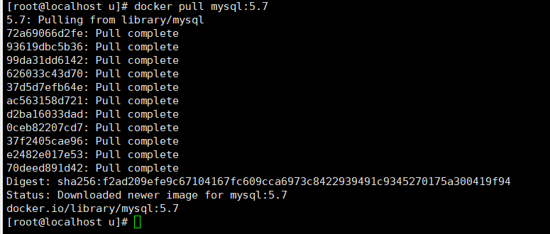 

### 3-3、使用mysql5.7镜像创建容器(也叫运行镜像)

1. 简单版

   1. 使用mysql镜像

      ```shell
      [root@localhost u]# docker run -p 3306:3306 -e MYSQL_ROOT_PASSWORD=123456 -d mysql:5.7
      282a63f1da72caca4e8f7607ea591d832ee970c6f9599f899bd8a4926020eba1
      ```

      若报错

      ```shell
      docker: Error response from daemon: driver failed programming external connectivity on endpoint practical_lamarr (611a651c0d0ae469cdace95eefc6f734299aa381c9e9861f23c28c3c9f74f77b): Error starting userland proxy: listen tcp4 0.0.0.0:3306: bind: address already in use.
      ```

      是由于linux的mysql已启动占用了3306需要关闭mysql服务

      ```shell
      [root@localhost u]# service mysqld stop
      ```

      继续启动mysql进入服务

      ```shell
      [root@localhost u]# docker ps
      CONTAINER ID   IMAGE                   COMMAND                  CREATED              STATUS              PORTS                                                  NAMES
      282a63f1da72   mysql:5.7               "docker-entrypoint.s…"   About a minute ago   Up About a minute   0.0.0.0:3306->3306/tcp, :::3306->3306/tcp, 33060/tcp   elated_sanderson
      [root@localhost u]# docker exec -it 282a63f1da72 /bin/bash
      root@282a63f1da72:/# mysql -uroot -p
      Enter password:
      ```

      

   2. 建库建表插入数据

      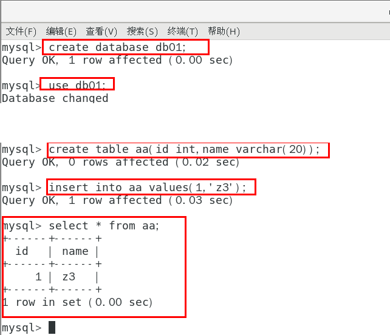 

   3. 外部Win10也来连接运行在dokcer上的mysql容器实例服务

       

   4. 问题

      插入中文数据试试 -->

       

      报错原因 --> docker上默认字符集编码隐患:

       

      同时该容器也不存在数据卷，安全性不高

2. 实战版

   1. 新建mysql容器实例

      > [root@localhost u]# docker run -d -p 3306:3306 
      >
      > --privileged=true 
      >
      > -v /zzyyuse/mysql/log:/var/log/mysql 
      >
      > -v /zzyyuse/mysql/data:/var/lib/mysql 
      >
      > -v /zzyyuse/mysql/conf:/etc/mysql/conf.d 
      >
      > -e MYSQL_ROOT_PASSWORD=123456  
      >
      > --name mysql mysql:5.7

      ```shell
      [root@localhost u]# docker run -d -p 3306:3306 --privileged=true -v /zzyyuse/mysql/log:/var/log/mysql -v /zzyyuse/mysql/data:/var/lib/mysql -v /zzyyuse/mysql/conf:/etc/mysql/conf.d -e MYSQL_ROOT_PASSWORD=123456  --name mysql mysql:5.7
      c0add9c5f42e7a9a72cdf04efbf321386f0785458affa6d2294ba7b675c5b8a6
      ```

   2. 新建my.cnf

      > 通过容器卷同步给mysql容器实例

      ```shell
      [root@localhost u]# cd /zzyyuse/mysql/conf
      [root@localhost conf]# ls
      [root@localhost conf]# vim my.cnf
      [client]
      default_character_set=utf8
      [mysqld]
      collation_server = utf8_general_ci
      character_set_server = utf8
      [root@localhost conf]# cat my.cnf
      [client]
      default_character_set=utf8
      [mysqld]
      collation_server = utf8_general_ci
      character_set_server = utf8
      ```

   3. 重新启动mysql容器实例再重新进入并查看字符编码

      ```shell
      [root@localhost conf]# docker restart mysql
      mysql
      [root@localhost conf]# docker exec -it mysql bash
      root@c0add9c5f42e:/# mysql -uroot -p
      Enter password: 
      ```

       

   4. 再新建库新建表再插入中文测试

      ```shell
      mysql> create database db01;
      Query OK, 1 row affected (0.02 sec)
      
      mysql> use db01;
      Database changed
      mysql> create table test(id int,name varchar(20));
      Query OK, 0 rows affected (0.01 sec)
      ```

       

   5. 结论：docker安装完MySQL并run出容器后，建议请`先修改完字符集编码后再新建mysql库-表-插数据`

   6. 假如将当前容器实例删除，再重新来一次，之前建的db01实例还有吗？trytry

      ```shell
      [root@localhost mysql]# docker rm -f mysql
      mysql
      [root@localhost mysql]# docker run -d -p 3306:3306 --privileged=true -v /zzyyuse/mysql/log:/var/log/mysql -v /zzyyuse/mysql/data:/var/lib/mysql -v /zzyyuse/mysql/conf:/etc/mysql/conf.d -e MYSQL_ROOT_PASSWORD=123456  --name mysql mysql:5.7
      6e3eb3a617bc504e0501838899d695847dd7c4ea70b7afaa6ef3cf7d2171fd99
      [root@localhost conf]# docker exec -it mysql bash
      root@6e3eb3a617bc:/# mysql -uroot -p 
      Enter password: 
      ```

      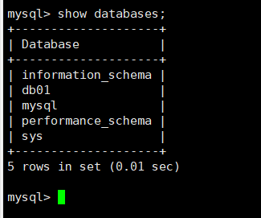 

      发现db01数据还在！


## 4、安装redis

### 4-1、拉取镜像

> 从docker hub上(阿里云加速器)拉取redis镜像到本地

```shell
[root@localhost ~]# docker pull redis
```

### 4-2、入门命令

```shell
#启动redis服务
[root@localhost ~]# docker run -d -p 6379:6379 --name redis redis
[root@localhost ~]# docker exec -it redis /bin/bash
root@456620e221ff:/data# redis-cli
127.0.0.1:6379> set k1 v1
OK
127.0.0.1:6379> get k1
"v1"
```

### 4-3、实战命令

1. 在CentOS宿主机下新建目录/app/redis

   ```shell
   root@localhost ~]# mkdir -p /app/redis
   ```

2. 将一个redis.conf文件模板拷贝进/app/redis目录下

   ```shell
   [root@localhost /]# cp /myredis/redis.conf /app/redis/
   [root@localhost /]# cd /app/redis
   [root@localhost redis]# ls
   redis.conf
   ```

3. `/app/redis`目录下修改redis.conf文件

   ```shell
   [root@localhost redis]# vim redis.conf
   ```

   1. 开启允许redis外地连接

      > 注释掉 # bind 127.0.0.1

       

   2. daemonize no（是否启动为后台进程）

      > 将daemonize yes注释起来或者 daemonize no设置，因为该配置和docker run中-d参数冲突，会导致容器一直启动失败

   3. 开启redis数据持久化(可选)

      > appendonly yes

4. 使用redis镜像创建容器（运行容器）

   ```shell
   [root@localhost redis]# docker run  -p 6379:6379 --name myredis --privileged=true -v /app/redis/redis.conf:/etc/redis/redis.conf -v /app/redis/data:/data -d redis redis-server /etc/redis/redis.conf
   [root@localhost redis]# docker ps
   CONTAINER ID   IMAGE     COMMAND                  CREATED         STATUS         PORTS                                       NAMES
   635bdcad2493   redis     "docker-entrypoint.s…"   6 seconds ago   Up 5 seconds   0.0.0.0:6379->6379/tcp, :::6379->6379/tcp   myredis
   ```

5. 测试redis-cli连接上来

   ```shell
   [root@localhost redis]# docker exec -it myredis /bin/bash
   root@635bdcad2493:/data# redis-cli
   127.0.0.1:6379> 
   
   #或者
   
   [root@localhost redis]# docker exec -it myredis redis-cli
   127.0.0.1:6379>
   ```

6. 证明docker启动使用了我们自己指定的配置文件

   1. 修改前

      ```shell
      127.0.0.1:6379> keys *
      (empty array)
      127.0.0.1:6379> set k1 v1
      OK
      127.0.0.1:6379> get k1
      "v1"
      127.0.0.1:6379> select 15
      OK
      127.0.0.1:6379[15]> select 16
      (error) ERR DB index is out of range
      127.0.0.1:6379[15]> exit
      ```

      我们用的配置文件，数据库默认是16个(0-15)

   2. 修改后

       

      重启redis服务

      宿主机的修改会同步给docker容器里面的配置。

      ```shell
      [root@localhost redis]# docker restart myredis
      myredis
      [root@localhost redis]# docker exec -it myredis redis-cli
      127.0.0.1:6379> keys *
      1) "k1"
      127.0.0.1:6379> select 11
      (error) ERR DB index is out of range
      127.0.0.1:6379> get k1
      "v1"
      ```

## 5、nginx安装


以上为Docker基础篇`

------

`下面为docker高级篇`

# 九、Docker复杂安装详说

## 1、安装mysql主从复制

1. `新建主服务器容器实例3307`

   > docker run -p 3307:3306 --name mysql-master \
   > -v /mydata/mysql-master/log:/var/log/mysql \
   > -v /mydata/mysql-master/data:/var/lib/mysql \
   > -v /mydata/mysql-master/conf:/etc/mysql \
   > -e MYSQL_ROOT_PASSWORD=root  \
   > -d mysql:5.7

   ```shell
   [root@localhost redis]# docker run -p 3307:3306 --name mysql-master \
   > -v /mydata/mysql-master/log:/var/log/mysql \
   > -v /mydata/mysql-master/data:/var/lib/mysql \
   > -v /mydata/mysql-master/conf:/etc/mysql \
   > -e MYSQL_ROOT_PASSWORD=root  \
   > -d mysql:5.7
   a255b50f9b35784db04152bab8600b1397fd967cf499b669662bb2d40fa3d0ef
   [root@localhost redis]# docker ps
   CONTAINER ID   IMAGE       COMMAND                  CREATED          STATUS          PORTS                                                  NAMES
   a255b50f9b35   mysql:5.7   "docker-entrypoint.s…"   24 seconds ago   Up 23 seconds   33060/tcp, 0.0.0.0:3307->3306/tcp, :::3307->3306/tcp   mysql-master
   ```

2. 进入/mydata/mysql-master/conf目录下新建my.cnf

   ```shell
   [root@localhost redis]# cd /mydata/mysql-master/conf
   [root@localhost conf]# ls
   [root@localhost conf]# vim my.cnf
   [mysqld]
   ## 设置server_id，同一局域网中需要唯一
   server_id=101 
   ## 指定不需要同步的数据库名称
   binlog-ignore-db=mysql  
   ## 开启二进制日志功能
   log-bin=mall-mysql-bin  
   ## 设置二进制日志使用内存大小（事务）
   binlog_cache_size=1M  
   ## 设置使用的二进制日志格式（mixed,statement,row）
   binlog_format=mixed  
   ## 二进制日志过期清理时间。默认值为0，表示不自动清理。
   expire_logs_days=7  
   ## 跳过主从复制中遇到的所有错误或指定类型的错误，避免slave端复制中断。
   ## 如：1062错误是指一些主键重复，1032错误是因为主从数据库数据不一致
   slave_skip_errors=1062
   
   ## 字符编码设置
   collation_server = utf8_general_ci
   character_set_server = utf8
   
   [client]
   default_character_set=utf8
   ```

3. 修改完配置后重启master实例

   ```shell
   [root@localhost conf]# docker restart mysql-master
   mysql-master
   ```

4. 进入mysql-master容器

   ```shell
   [root@localhost conf]# docker exec -it mysql-master /bin/bash
   root@a255b50f9b35:/# mysql -uroot -proot
   .....
   Type 'help;' or '\h' for help. Type '\c' to clear the current input statement.
   
   mysql> 
   ```

5. master容器实例内创建数据同步用户

   ```shell
   #新建用户
   mysql> CREATE USER 'slave'@'%' IDENTIFIED BY '123456';
   Query OK, 0 rows affected (0.01 sec)
   
   #用户授予权限
   mysql> GRANT REPLICATION SLAVE, REPLICATION CLIENT ON *.* TO 'slave'@'%';
   Query OK, 0 rows affected (0.00 sec)
   
   ```

6. `新建从服务器容器实例3308`

   > docker run -p 3308:3306 --name mysql-slave \
   > -v /mydata/mysql-slave/log:/var/log/mysql \
   > -v /mydata/mysql-slave/data:/var/lib/mysql \
   > -v /mydata/mysql-slave/conf:/etc/mysql \
   > -e MYSQL_ROOT_PASSWORD=root  \
   > -d mysql:5.7

   ```shell
   [root@localhost ~]# docker run -p 3308:3306 --name mysql-slave \
   > -v /mydata/mysql-slave/log:/var/log/mysql \
   > -v /mydata/mysql-slave/data:/var/lib/mysql \
   > -v /mydata/mysql-slave/conf:/etc/mysql \
   > -e MYSQL_ROOT_PASSWORD=root  \
   > -d mysql:5.7
   1215820fdbe0a7e525fa299167c51648a4b28a3e73951cede7d3adf52c516cd4
   [root@localhost ~]# docker ps
   CONTAINER ID   IMAGE       COMMAND                  CREATED          STATUS         PORTS                                                  NAMES
   1215820fdbe0   mysql:5.7   "docker-entrypoint.s…"   3 seconds ago    Up 1 second    33060/tcp, 0.0.0.0:3308->3306/tcp, :::3308->3306/tcp   mysql-slave
   a255b50f9b35   mysql:5.7   "docker-entrypoint.s…"   19 minutes ago   Up 3 minutes   33060/tcp, 0.0.0.0:3307->3306/tcp, :::3307->3306/tcp   mysql-master
   ```

7. 进入/mydata/mysql-slave/conf目录下新建my.cnf

   ```shell
   [mysqld]
   ## 设置server_id，同一局域网中需要唯一
   server_id=102
   ## 指定不需要同步的数据库名称
   binlog-ignore-db=mysql  
   ## 开启二进制日志功能，以备Slave作为其它数据库实例的Master时使用
   log-bin=mall-mysql-slave1-bin  
   ## 设置二进制日志使用内存大小（事务）
   binlog_cache_size=1M  
   ## 设置使用的二进制日志格式（mixed,statement,row）
   binlog_format=mixed  
   ## 二进制日志过期清理时间。默认值为0，表示不自动清理。
   expire_logs_days=7  
   ## 跳过主从复制中遇到的所有错误或指定类型的错误，避免slave端复制中断。
   ## 如：1062错误是指一些主键重复，1032错误是因为主从数据库数据不一致
   slave_skip_errors=1062  
   ## relay_log配置中继日志
   relay_log=mall-mysql-relay-bin  
   ## log_slave_updates表示slave将复制事件写进自己的二进制日志
   log_slave_updates=1  
   ## slave设置为只读（具有super权限的用户除外）
   read_only=1
   
   ## 字符编码设置
   collation_server = utf8_general_ci
   character_set_server = utf8
   
   [client]
   default_character_set=utf8
   ```

8. 修改完配置后重启slave实例

   ```shell
   [root@localhost conf]# docker restart mysql-slave
   mysql-slave
   ```

9. 在主数据库中查看主从同步状态

   ```shell
   mysql> show master status;
   +-----------------------+----------+--------------+------------------+-------------------+
   | File                  | Position | Binlog_Do_DB | Binlog_Ignore_DB | Executed_Gtid_Set |
   +-----------------------+----------+--------------+------------------+-------------------+
   | mall-mysql-bin.000002 |      617 |              | mysql            |                   |
   +-----------------------+----------+--------------+------------------+-------------------+
   1 row in set (0.01 sec)
   ```

10. 进入mysql-slave容器

    ```shell
    [root@localhost conf]# docker exec -it mysql-slave /bin/bash
    root@1215820fdbe0:/# mysql -uroot -proot
    ```

11. 在`从数据库`中配置主从复制

    > change master to master_host='宿主机ip', master_user='slave', master_password='123456', master_port=3307, master_log_file='查看主数据的状态，获取File参数', master_log_pos=查看主数据的状态，获取Position参数, master_connect_retry=30;

    ```shell
    mysql> change master to master_host='10.1.53.169', master_user='slave', master_password='123456', master_port=3307, master_log_file='mall-mysql-bin.000002', master_log_pos=617, master_connect_retry=30;
    Query OK, 0 rows affected, 2 warnings (0.04 sec)
    ```

    主从复制命令参数说明

    > master_host：主数据库的IP地址；
    > master_port：主数据库的运行端口；
    > master_user：在主数据库创建的用于同步数据的用户账号；
    > master_password：在主数据库创建的用于同步数据的用户密码；
    > master_log_file：指定从数据库要复制数据的日志文件，通过查看主数据的状态，获取File参数；
    > master_log_pos：指定从数据库从哪个位置开始复制数据，通过查看主数据的状态，获取Position参数；
    > master_connect_retry：连接失败重试的时间间隔，单位为秒。

12. 在`从数据库`中查看主从同步状态

    ```shell
    mysql> show slave status \G;
    ```

     

13. 在从数据库中开启主从同步

    ```shell
    mysql> start slave;
    Query OK, 0 rows affected (0.02 sec)
    ```

14. 查看从数据库状态发现已经同步

     

15. 主从复制测试

    > 新建库-使用库-新建表-插入数据

    ```mysql
    mysql> create database test01;
    Query OK, 1 row affected (0.01 sec)
    
    mysql> use test01;
    Database changed
    mysql> create table t1(id int,name varchar(20));
    Query OK, 0 rows affected (0.02 sec)
    
    mysql> show tables;
    +------------------+
    | Tables_in_test01 |
    +------------------+
    | t1               |
    +------------------+
    1 row in set (0.00 sec)
    mysql> insert into t1 values(1,'lambert');
    Query OK, 1 row affected (0.00 sec)
    mysql> select * from t1
        -> ;
    +------+---------+
    | id   | name    |
    +------+---------+
    |    1 | lambert |
    +------+---------+
    1 row in set (0.01 sec)
    ```

16. 从机使用库-查看记录

     

## 2、安装redis集群(大厂面试题第4季-分布式存储案例真题)

> cluster(集群)模式-docker版 哈希槽分区进行亿级数据存储

### 2-1、面试题

> 1~2亿条数据需要缓存，请问如何设计这个存储案例
>
> 单机单台100%不可能，肯定是分布式存储，用redis如何落地？

上述问题阿里P6~P7工程案例和场景设计类必考题目，
一般业界有3种解决方案

1. 哈希取余分区

    

   2亿条记录就是2亿个k,v，我们单机不行必须要分布式多机，假设有3台机器构成一个集群，用户每次读写操作都是根据公式：

   > hash(key) % N个机器台数，计算出哈希值，用来决定数据映射到哪一个节点上。

   优点：
   简单粗暴，直接有效，只需要预估好数据规划好节点，例如3台、8台、10台，就能保证一段时间的数据支撑。使用Hash算法让固定的一部分请求落到同一台服务器上，这样每台服务器固定处理一部分请求（并维护这些请求的信息），起到负载均衡+分而治之的作用。

   缺点：
   原来规划好的节点，进行扩容或者缩容就比较麻烦了额，不管扩缩，每次数据变动导致节点有变动，映射关系需要重新进行计算，在服务器个数固定不变时没有问题，如果需要弹性扩容或故障停机的情况下，原来的取模公式就会发生变化：Hash(key)/3会变成Hash(key) /?。此时地址经过取余运算的结果将发生很大变化，根据公式获取的服务器也会变得不可控。
   某个redis机器宕机了，由于台数数量变化，会导致hash取余全部数据重新洗牌。

2. 一致性哈希算法分区

   一致性哈希算法在1997年由麻省理工学院中提出的，设计目标是为了解决`分布式缓存数据变动和映射问题，某个机器宕机了，分母数量改变了，自然取余数不OK了。`

   提出一致性Hash解决方案。目的是当服务器个数发生变动时，尽量减少影响客户端到服务器的映射关系

   `三大步骤`

   1. 算法构建一致性哈希环

      一致性哈希算法必然有个hash函数并按照算法产生hash值，这个算法的所有可能哈希值会构成一个全量集，这个集合可以成为一个hash空间[0,2^32-1]，这个是一个线性空间，但是在算法中，我们通过适当的逻辑控制将它首尾相连(0 = 2^32),这样让它逻辑上形成了一个环形空间。

      它也是按照使用取模的方法，前面笔记介绍的节点取模法是对节点（服务器）的数量进行取模。而一致性Hash算法是对2^32取模，简单来说，`一致性Hash算法将整个哈希值空间组织成一个虚拟的圆环`，如假设某哈希函数H的值空间为0-2^32-1（即哈希值是一个32位无符号整形），整个哈希环如下图：整个空间按`顺时针方向组织`，圆环的正上方的点代表0，0点右侧的第一个点代表1，以此类推，2、3、4、……直到2^32-1，也就是说0点左侧的第一个点代表2^32-1， 0和2^32-1在零点中方向重合，我们把这个由2^32个点组成的圆环称为Hash环。

       

   2. 服务器IP节点映射

      > 节点映射:将集群中各个IP节点映射到环上的某一个位置。

      将各个服务器使用Hash进行一个哈希，具体可以选择服务器的IP或主机名作为关键字进行哈希，这样每台机器就能确定其在哈希环上的位置。假如4个节点NodeA、B、C、D，经过IP地址的`哈希函数`计算(hash(ip))，使用IP地址哈希后在环空间的位置如下

       

   3. key落到服务器的落键规则

      当我们需要存储一个kv键值对时，首先计算key的hash值，hash(key)，将这个key使用相同的函数Hash计算出哈希值并确定此数据在环上的位置，`从此位置沿环顺时针“行走”`，第一台遇到的服务器就是其应该定位到的服务器，并将该键值对存储在该节点上。

      如我们有Object A、Object B、Object C、Object D四个数据对象，经过哈希计算后，在环空间上的位置如下：根据一致性Hash算法，数据A会被定为到Node A上，B被定为到Node B上，C被定为到Node C上，D被定为到Node D上。

       

   优点：

   1. 一致性哈希算法的容错性:

      假设Node C宕机，可以看到此时对象A、B、D不会受到影响，只有C对象被重定位到Node D。一般的，在一致性Hash算法中，如果一台服务器不可用，则`受影响的数据仅仅是此服务器到其环空间中前一台服务器（即沿着逆时针方向行走遇到的第一台服务器）之间数据`，其它不会受到影响。简单说，就是C挂了，受到影响的只是B、C之间的数据，并且这些数据会转移到D进行存储。

       

   2. 扩展性
      数据量增加了，需要增加一台节点NodeX，X的位置在A和B之间，那收到影响的也就是A到X之间的数据，重新把A到X的数据录入到X上即可，
      不会导致hash取余全部数据重新洗牌。

      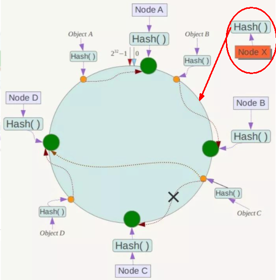 

   缺点：一致性哈希算法的数据倾斜问题

   Hash环的数据倾斜问题
   一致性Hash算法在`服务节点太少`时，容易因为节点分布不均匀而`造成数据倾斜`（被缓存的对象大部分集中缓存在某一台服务器上）问题，例如系统中只有两台服务器：

    

   小总结：

   为了在节点数目发生改变时尽可能少的迁移数据,将所有的存储节点排列在收尾相接的Hash环上，每个key在计算Hash后会`顺时针`找到临近的存储节点存放。而当有节点加入或退出时`仅影响该节点在Hash环上顺时针相邻的后续节点`。  

   优点:加入和删除节点只影响哈希环中顺时针方向的相邻的节点，对其他节点无影响。

   缺点:数据的分布和节点的位置有关，因为这些节点不是均匀的分布在哈希环上的，所以数据在进行存储时达不到均匀分布的效果。

3. 哈希槽分区

   `由于一致性哈希算法的数据倾斜问题`,出现了哈希槽分区，哈希槽实质就是一个数组，数组[0,2^14 -1]形成hash slot空间。

   能干什么：解决均匀分配的问题，`在数据和节点之间又加入了一层，把这层称为哈希槽（slot），用于管理数据和节点之间的关系`，现在就相当于节点上放的是槽，槽里放的是数据。

    

   槽解决的是粒度问题，相当于把粒度变大了，这样便于数据移动。
   哈希解决的是映射问题，使用key的哈希值来计算所在的槽，便于数据分配。

   一个集群只能有16384个槽，编号0-16383（0-2^14-1）。这些槽会分配给集群中的所有主节点，分配策略没有要求。可以指定哪些编号的槽分配给哪个主节点。集群会记录节点和槽的对应关系。解决了节点和槽的关系后，接下来就需要对key求哈希值，然后对16384取余，余数是几key就落入对应的槽里。slot = CRC16(key) % 16384。以槽为单位移动数据，因为槽的数目是固定的，处理起来比较容易，这样数据移动问题就解决了。

   1. 哈希槽计算

      Redis 集群中内置了 16384 个哈希槽，redis 会根据节点数量大致均等的将哈希槽映射到不同的节点。当需要在 Redis 集群中放置一个 key-value时，redis 先对 key 使用 crc16 算法算出一个结果，然后把结果对 16384 求余数，这样每个 key 都会对应一个编号在 0-16383 之间的哈希槽，也就是映射到某个节点上。如下代码，key之A 、B在Node2， key之C落在Node3上

       

       

### 2-2、Redis集群(3主3从)配置

> 前提：关闭防火墙(6381~6386)+启动docker后台服务

```shell
# 查看已开放防火墙的端口
[root@localhost ~]# firewall-cmd --zone=public --list-ports
8010/tcp 8080/tcp 8081/tcp 8082/tcp 9001/tcp 80/tcp 15672/tcp 5672/tcp 6379/tcp 8801/tcp 1111/tcp 3333/tcp 4444/tcp 5555/tcp 3308/tcp 3307/tcp
# 批量开放端口6381-6386
[root@localhost ~]# firewall-cmd --zone=public --add-port=6381-6386/tcp --permanent
success
# 重启更新防火墙设置
[root@localhost ~]# firewall-cmd --reload
success
```

1. 新建6个docker容器redis实例

   ```shell
   docker run -d --name redis-node-1 --net host --privileged=true -v /data/redis/share/redis-node-1:/data redis:6.0.8 --cluster-enabled yes --appendonly yes --port 6381
    
   docker run -d --name redis-node-2 --net host --privileged=true -v /data/redis/share/redis-node-2:/data redis:6.0.8 --cluster-enabled yes --appendonly yes --port 6382
    
   docker run -d --name redis-node-3 --net host --privileged=true -v /data/redis/share/redis-node-3:/data redis:6.0.8 --cluster-enabled yes --appendonly yes --port 6383
    
   docker run -d --name redis-node-4 --net host --privileged=true -v /data/redis/share/redis-node-4:/data redis:6.0.8 --cluster-enabled yes --appendonly yes --port 6384
    
   docker run -d --name redis-node-5 --net host --privileged=true -v /data/redis/share/redis-node-5:/data redis:6.0.8 --cluster-enabled yes --appendonly yes --port 6385
    
   docker run -d --name redis-node-6 --net host --privileged=true -v /data/redis/share/redis-node-6:/data redis:6.0.8 --cluster-enabled yes --appendonly yes --port 6386
   
   [root@localhost ~]# docker ps
   CONTAINER ID   IMAGE         COMMAND                  CREATED          STATUS         PORTS                                                  NAMES
   429b1d9f0d12   redis:6.0.8   "docker-entrypoint.s…"   3 seconds ago    Up 2 seconds                                                          redis-node-6
   bd6c733a20a1   redis:6.0.8   "docker-entrypoint.s…"   8 seconds ago    Up 6 seconds                                                          redis-node-5
   35c3e6a5d6b8   redis:6.0.8   "docker-entrypoint.s…"   8 seconds ago    Up 7 seconds                                                          redis-node-4
   ac5f0f42b6bd   redis:6.0.8   "docker-entrypoint.s…"   8 seconds ago    Up 8 seconds                                                          redis-node-3
   569027a164af   redis:6.0.8   "docker-entrypoint.s…"   9 seconds ago    Up 8 seconds                                                          redis-node-2
   e474d13e0eee   redis:6.0.8   "docker-entrypoint.s…"   12 seconds ago   Up 9 seconds                                                          redis-node-1
   ```

   命令解释：

   1. docker run 创建并运行docker容器实例
   2. --name redis-node-6 容器名字
   3. --net host 使用宿主机的IP和端口，默认
   4. --privileged=true 获取宿主机root用户权限
   5. -v /data/redis/share/redis-node-6:/data 容器卷，宿主机地址:docker内部地址
   6. redis:6.0.8 redis镜像和版本号
   7. --cluster-enabled yes 开启redis集群
   8. --appendonly yes 开启持久化
   9. --port 6386 redis端口号

2. 进入容器redis-node-1并为6台机器构建集群关系

   ```shell
   [root@localhost ~]# docker exec -it redis-node-1 /bin/bash
   ```

   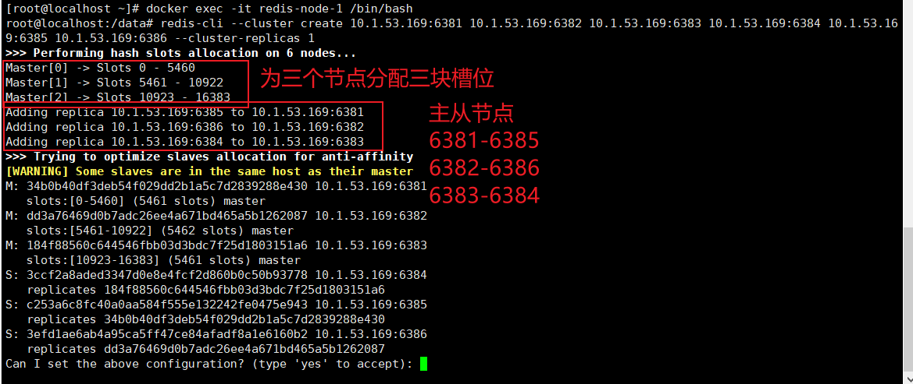 

   > redis-cli --cluster create 10.1.53.169:6381 10.1.53.169:6382 10.1.53.169:6383 10.1.53.169:6384 10.1.53.169:6385 10.1.53.169:6386 --cluster-replicas 1

   `--cluster-replicas 1 表示为每个master创建一个slave节点`

   3主3从集群完成

3. 链接进入6381作为切入点，查看集群状态

   > redis-cli -p 6381
   >
   > cluster info 查看集群信息
   >
   > cluster nodes 查看集群节点信息

    

   master 6381 —— slave 6385

   master 6382 —— slave 6386

   master 6383 —— slave 6384

### 2-3、主从容错切换迁移案例

#### 2-3-1、数据读写存储

1. 启动`6机`构成的集群并通过exec进入

   ```shell
   [root@localhost ~]# docker exec -it redis-node-1 /bin/bash
   root@localhost:/data# redis-cli -p 6381
   ```

2. 对6381新增两个key

   ```shell
   127.0.0.1:6381> keys *
   (empty array)
   127.0.0.1:6381> set k1 v1
   # 报错由于k1计算哈希值后为12706 6381端口的的哈希槽范围为（0-5360）
   (error) MOVED 12706 10.1.53.169:6383
   
   # 解决：防止路由失效加参数-c连接redis集群并新增两个key
   root@localhost:/data# redis-cli -p 6381 -c
   127.0.0.1:6381> keys *
   (empty array)
   127.0.0.1:6381> set k1 v1
   -> Redirected to slot [12706] located at 10.1.53.169:6383
   OK
   10.1.53.169:6383> set k2 v2
   -> Redirected to slot [449] located at 10.1.53.169:6381
   OK
   ```

3. 查看集群信息

   > redis-cli --cluster check 10.1.53.169:6381

   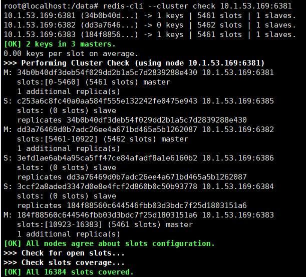 

#### 2-3-2、容错切换迁移

1. 原本master 6381 —— slave 6385

   ```shell
   34b0b40df3deb54f029dd2b1a5c7d2839288e430 10.1.53.169:6381@16381 myself,master - 0 1652941775000 1 connected 0-5460
   c253a6c8fc40a0aa584f555e132242fe0475e943 10.1.53.169:6385@16385 slave 34b0b40df3deb54f029dd2b1a5c7d2839288e430 0 1652941775000 1 connected
   ```

2. 主6381和从机切换，先停止主机6381

   ```shell
   [root@localhost ~]# docker stop redis-node-1
   redis-node-1
   [root@localhost ~]# docker exec -it redis-node-2 bash
   root@localhost:/data# redis-cli -p 6382 -c
   127.0.0.1:6382> cluster nodes
   ```

3. 6381宕机了，6385上位成为了新的master。

   ```shell
   34b0b40df3deb54f029dd2b1a5c7d2839288e430 10.1.53.169:6381@16381 master,fail - 1652941816977 1652941812000 1 disconnected
   c253a6c8fc40a0aa584f555e132242fe0475e943 10.1.53.169:6385@16385 master - 0 1652941866000 7 connected 0-5460
   ```

4. 前面存的k1和k2正常存在

   ```shell
   127.0.0.1:6382> get k1
   -> Redirected to slot [12706] located at 10.1.53.169:6383
   "v1"
   10.1.53.169:6383> get k2
   -> Redirected to slot [449] located at 10.1.53.169:6385
   "v2"
   ```

5. 先还原之前的3主3从,启动6381

   ```shell
   [root@localhost ~]# docker start redis-node-1
   redis-node-1
   10.1.53.169:6385> cluster nodes
   c253a6c8fc40a0aa584f555e132242fe0475e943 10.1.53.169:6385@16385 myself,master - 0 1652942460000 7 connected 0-5460
   34b0b40df3deb54f029dd2b1a5c7d2839288e430 10.1.53.169:6381@16381 slave c253a6c8fc40a0aa584f555e132242fe0475e943 0 1652942463000 7 connected
   ...
   ```

   6385仍是主机，6381成为6385的从机

6. 我们现在恢复6381为主机，6385为从机，先关闭6385在启动6385即可

7. 查看集群状态

   ```shell
   root@localhost:/data# redis-cli --cluster check 10.1.53.169:6381
   ```

    

### 2-4、主从扩容案例

1. 新建6387、6388两个节点+新建后启动+查看是否8节点

   ```shell
   [root@localhost ~]# docker run -d --name redis-node-7 --net host --privileged=true -v /data/redis/share/redis-node-7:/data redis:6.0.8 --cluster-enabled yes --appendonly yes --port 6387
   f7e6abd2fdba344f52e38a593719daa3e45f4bdb8777d22ab8b73a4e62a29112
   [root@localhost ~]# docker run -d --name redis-node-8 --net host --privileged=true -v /data/redis/share/redis-node-8:/data redis:6.0.8 --cluster-enabled yes --appendonly yes --port 6388
   cc1b08da3ca5c8244a4d63b5f890a2ba73f879d09c65d1b7044f54aebf8ad7f2
   ```

   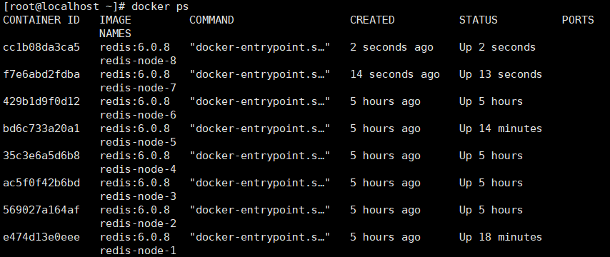 

2. 进入6387容器实例内部

   ```shell
   [root@localhost ~]# docker exec -it redis-node-7 /bin/bash
   root@localhost:/data# 
   ```

3. 将新增的6387节点(空槽号)作为master节点加入原集群

   > 将新增的6387作为master节点加入集群
   > `redis-cli --cluster add-node 自己实际IP地址:6387 自己实际IP地址:6381`
   >
   > 6387 就是将要作为master新增节点
   > 6381 就是原来集群节点里面的领路人，相当于6387通过6381从而找到组织加入集群

   ```shell
   root@localhost:/data# root@localhost:/data# redis-cli --cluster add-node 10.1.53.169:6387 10.1.53.169:6381
   >>> Adding node 10.1.53.169:6387 to cluster 10.1.53.169:6381
   >>> Performing Cluster Check (using node 10.1.53.169:6381)
   ...
   ```

4. 检查集群情况

   ```shell
   root@localhost:/data# redis-cli --cluster check 10.1.53.169:6381
   ```

     

   6387没有分配到哈希槽

5. 重新分派槽号

   > 命令:redis-cli --cluster reshard IP地址:端口号

   ```shell
   root@localhost:/data# redis-cli --cluster reshard 10.1.53.169:6381
   ....
   How many slots do you want to move (from 1 to 16384)?4096
   What is the receiving node ID?6ade1f47c9b8011d9abae7e45b38e3a33df289aa
   Please enter all the source node IDs.
     Type 'all' to use all the nodes as source nodes for the hash slots.
     Type 'done' once you entered all the source nodes IDs.
   Source node #1: all
   ```

   > How many slots do you want to move (from 1 to 16384)?

   最后需要自己分配集群的槽位（16384/4=4096）所以这里输入4096

   > What is the receiving node ID?

   分配给哪个新机器，这里输入新机器的ID，6387的id：6ade1f47c9b8011d9abae7e45b38e3a33df289aa

   > Please enter all the source node IDs.
   >
   > ...
   >
   > Source node #1: 

   这里输入all选择所有节点重新分配

6. 再次检查集群情况

   ```shell
   root@localhost:/data# redis-cli --cluster check 10.1.53.169:6381
   ```

    

   > 这里可以发现6387的槽位分为了三块[0-1364],[5461-6826],[10923-12287]

   原因：重新分配成本太高，所以前3家各自匀出来一部分，从6381/6382/6383三个旧节点分别匀出1364个坑位给新节点6387

   原本					现在：

   1. 6381：0-5460			6381：1365-5460（从开头0分出[0-1364]给6387）
   2. 6382：5361-10922    	6382：6827-10922（从开头5361分出[5461-6826]）
   3. 6383：10923-16383		6383：12288-16383（从开头10923分出[10923-12287])

7. 为主节点6387分配从节点6388

   > redis-cli --cluster add-node ip:新slave端口 ip:新master端口 --cluster-slave --cluster-master-id 新主机节点ID

   ```shell
   root@localhost:/data# redis-cli --cluster add-node 10.1.53.169:6388 10.1.53.169:6387 --cluster-slave --cluster-master-id 6ade1f47c9b8011d9abae7e45b38e3a33df289aa
   ```

8. 再再次检查集群情况

    

9. 存值情况

   > 原本k2存储在6381的槽位，现在449的槽位分给了6387

   ```shell
   10.1.53.169:6383> get k2
   -> Redirected to slot [449] located at 10.1.53.169:6387
   "v2"
   10.1.53.169:6387>
   ```

### 2-5、主从缩容案例

> 目的：6387和6388下线
>
> 思路：
>
> 1. 先清除从节点6388
> 2. 清出来的槽号重新分配
> 3. 再删除6487主节点

1. 检查集群情况1获得6388的节点ID

   ```shell
   root@localhost:/data# redis-cli --cluster check 10.1.53.169:6382
   ```

    

   1ee3fa5fb7fffd6a15d8bdf1ec71fe3e2e4ec326

2. 将从机6388删除,从集群中将4号从节点6388删除

   > 命令：redis-cli --cluster del-node ip:从机端口 从机6388节点ID

   ```shell
   root@localhost:/data# redis-cli --cluster del-node 10.1.53.169:6388 1ee3fa5fb7fffd6a15d8bdf1ec71fe3e2e4ec326
   >>> Removing node 1ee3fa5fb7fffd6a15d8bdf1ec71fe3e2e4ec326 from cluster 10.1.53.169:6388
   >>> Sending CLUSTER FORGET messages to the cluster...
   >>> Sending CLUSTER RESET SOFT to the deleted node.
   # 查看集群情况 确保6388被删除
   root@localhost:/data# redis-cli --cluster check 10.1.53.169:6382
   ```

    

   删除成功，只剩下七个节点

3. 将6387的槽号清空，重新分配，本例将清出来的槽号都给6381

   ```shell
   root@localhost:/data# redis-cli --cluster reshard 10.1.53.169:6381
   ```

    

4. 再次检查集群情况

   ```shell
   root@localhost:/data# redis-cli --cluster check 10.1.53.169:6382
   ```

   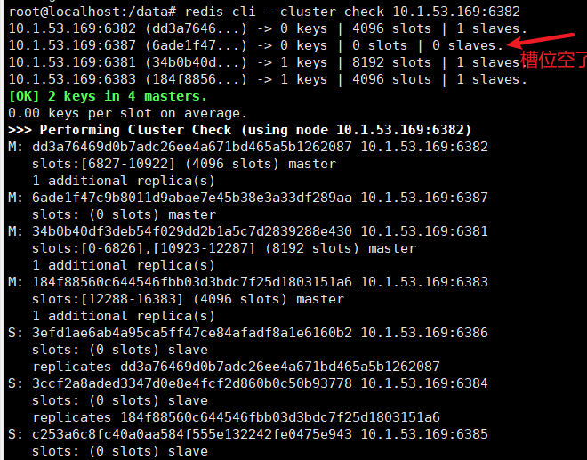 

5. 将6387删除

   > 命令：redis-cli --cluster del-node ip:端口 6387节点ID

   ```shell
   root@localhost:/data# redis-cli --cluster del-node 10.1.53.169:6387 6ade1f47c9b8011d9abae7e45b38e3a33df289aa
   >>> Removing node 6ade1f47c9b8011d9abae7e45b38e3a33df289aa from cluster 10.1.53.169:6387
   >>> Sending CLUSTER FORGET messages to the cluster...
   >>> Sending CLUSTER RESET SOFT to the deleted node.
   ```

6. 再次检查集群情况

   ```shell
   root@localhost:/data# redis-cli --cluster check 10.1.53.169:6381 
   ```

    

   只剩下六个节点了

### 2-6、总结

> 主从扩容流程：
>
> 1. 新建两个新节点
> 2. 将一个节点作为主节点加入到集群内
> 3. 给新的主节点分配n个槽位(n=总槽位/主节点数),分配规则其他所有节点都会分出(n/主节点数)个槽位给新的主节点
> 4. 为主节点分配从节点

> 主从缩容流程：
>
> 1. 先删除从节点
> 2. 将准备删除的主节点的槽号都清出来的槽号重新分配（采用统一分给一个节点的方式）
> 3. 再删除主节点


# 十、DockerFile解析

## 1、DockerFile是什么

> Dockerfile是用来构建Docker镜像的文本文件，是由一条条构建镜像所需的指令和参数构成的脚本。

### 1-1、概述

 

官网：https://docs.docker.com/engine/reference/builder/

### 1-2、构建三步骤

1. 编写Dockerfile文件
2. docker build命令构建镜像
3. docker run依镜像运行容器实例

## 2、DockerFile构建过程解析

### 2-1、Dockerfile内容基础知识

1. 每条保留字指令都`必须为大写字母`且后面要跟随至少一个参数
2. 指令按照从上到下，顺序执行
3. #表示注释
4. 每条指令都会创建一个新的镜像层并对镜像进行提交

### 2-2、Docker执行Dockerfile的大致流程

1. docker从基础镜像运行一个容器
2. 执行一条指令并对容器作出修改
3. 执行类似docker commit的操作提交一个新的镜像层
4. docker再基于刚提交的镜像运行一个新容器
5. 执行dockerfile中的下一条指令直到所有指令都执行完成

### 2-3、小总结

从应用软件的角度来看，Dockerfile、Docker镜像与Docker容器分别代表软件的三个不同阶段，
*  Dockerfile是软件的原材料
*  Docker镜像是软件的交付品
*  Docker容器则可以认为是软件镜像的运行态，也即依照镜像运行的容器实例

 

1. Dockerfile，需要定义一个Dockerfile，Dockerfile定义了进程需要的一切东西。Dockerfile涉及的内容包括执行代码或者是文件、环境变量、依赖包、运行时环境、动态链接库、操作系统的发行版、服务进程和内核进程(当应用进程需要和系统服务和内核进程打交道，这时需要考虑如何设计namespace的权限控制)等等;
2. Docker镜像，在用Dockerfile定义一个文件之后，docker build时会产生一个Docker镜像，当运行 Docker镜像时会真正开始提供服务;
3. Docker容器，容器是直接提供服务的。

## 3、DockerFile常用保留字指令

> 参考tomcat8的dockerfile入门：https://github.com/docker-library/tomcat

1. FROM：基础镜像，当前新镜像是基于哪个镜像的，指定一个已经存在的镜像作为模板，第一条必须是from

   ```shell
   FROM ubuntu
   ```

2. MAINTAINER：镜像维护者的姓名和邮箱地址

   ```dockerfile
   MAINTAINER zzyy<zzyybs@126.com>
   ```

3. RUN：容器构建时需要运行的命令

   两种格式：

   1. shell格式：RUN <命令行命令> 

      <命令行命令>等同于在终端操作的shell命令

      ```dockerfile
      RUN yum -y install vim
      ```

   2. exec格式：RUN ["可执行文件","参数1","参数2"]

      例如：

      ```dockerfile
      RUN ["./test.php","dev","offline"] 等价于 RUN ./test.php dev offline
      ```

   RUN是在 docker build时运行

4. EXPOSE：当前容器对外暴露出的端口

5. WORKDIR：指定在创建容器后，终端默认登陆的进来工作目录，一个落脚点

   相当于下面 run后进来的目录

   ```shell
   [root@localhost ~]# docker run -it ubuntu /bin/bash
   root@294674c13fcf:/# pwd
   /
   ```

6. USER：指定该镜像以什么样的用户去执行，如果都不指定，默认是root

7. ENV：用来在构建镜像过程中设置环境变量

   > ENV MY_PATH /usr/mytest:这个环境变量可以在后续的任何RUN指令中使用，这就如同在命令前面指定了环境变量前缀一样；
   > 也可以在其它指令中直接使用这些环境变量，
   >
   > 比如：引用WORKDIR $MY_PATH后 创建容器会落脚到/usr/mytest

8. ADD：将宿主机目录下的文件拷贝进镜像且会自动处理URL和解压tar压缩包

9. COPY：类似ADD，拷贝文件和目录到镜像中。将从构建上下文目录中<源路径>的文件/目录复制到新的一层的镜像内的 <目标路径> 位置

   > COPY src dest / COPY ["src", "dest"]

   <src源路径>：源文件或者源目录

   <dest目标路径>：容器内的指定路径，该路径不用事先建好，路径不存在的话，会自动创建。

10. VOLUME：容器数据卷，用于数据保存和持久化工作

11. CMD:指定容器启动后的要干的事情

     

    注意：Dockerfile 中可以有多个 CMD 指令，`但只有最后一个生效，CMD 会被 docker run 之后的参数替换`

    参考官网Tomcat的dockerfile演示讲解:

    - 官网最后一行命令

       

      正常启动就会运行上面的命令

      ```shell
      [root@localhost ~]# docker run -it -p 8080:8080 tomcat
      CONTAINER ID   IMAGE         COMMAND                  CREATED              STATUS              PORTS                                                  NAMES
      09afbfe97558   tomcat        "catalina.sh run"        About a minute ago   Up About a minute   0.0.0.0:8080->8080/tcp, :::8080->8080/tcp              festive_boyd
      ```

        

      若修改一下运行命令

      ```shell
      [root@localhost ~]# docker run -it -p 8080:8080 tomcat /bin/bash
      root@6618ca57fa6c:/usr/local/tomcat#
      ```

      会覆盖CMD ["catalina.sh","run"]为["/bin/bash","run"]

      ```shell
      CONTAINER ID   IMAGE         COMMAND                  CREATED              STATUS              PORTS                                                  NAMES
      6618ca57fa6c   tomcat        "/bin/bash"              About a minute ago   Up About a minute   0.0.0.0:8080->8080/tcp, :::8080->8080/tcp              tender_swirles
      ```

    它和前面RUN命令的区别:CMD是在docker run 时运行。RUN是在 docker build时运行。

12. ENTRYPOINT:也是用来指定一个容器启动时要运行的命令

    类似于 CMD 指令，但是ENTRYPOINT`不会被docker run后面的命令覆盖`，而且这些命令行参数`会被当作参数送给 ENTRYPOINT 指令指定的程序`

    > 命令格式：ENTRYPOINT ["<executeable>","<param1>","<params2>",...]

    ENTRYPOINT可以和CMD一起用，一般是变参才会使用 CMD ，这里的 CMD 等于是在给 ENTRYPOINT 传参。

    当指定了ENTRYPOINT后，CMD的含义就发生了变化，不再是直接运行其命令而是将CMD的内容作为参数传递给ENTRYPOINT指令，他两个组合会变成

    案例如下：假设已通过 Dockerfile 构建了 `nginx:test 镜像`：

    ```dockerfile
    FROM nginx
    
    ENTRYPOINT ["nginx","-c"] #定参
    CMD ["/etc/nginx/nginx.conf"] #变参
    ```

    

    优点：在执行docker run的时候可以指定 ENTRYPOINT 运行所需的参数。

    注意：如果 Dockerfile 中如果存在多个 ENTRYPOINT 指令，仅最后一个生效。

13. 小总结

     

## 4、自定义镜像mycentosjava8

### 4-1、要求

> Centos7镜像具备vim+ifconfig+jdk8

> JDK的下载镜像地址：
>
> 1. 官网：https://www.oracle.com/java/technologies/downloads/#java8
> 2. 镜像：https://mirrors.yangxingzhen.com/jdk/

### 4-2、准备编写`Dockerfile`文件

> 新建DockerFile文件并将jdk8拖进来目录

```shell
[root@localhost ~]# mkdir /myfile
[root@localhost ~]# cd /myfile
[root@localhost myfile]# ls
jdk-8u171-linux-x64.tar.gz
[root@localhost myfile]# vim Dockerfile
FROM centos:7
MAINTAINER zzyy<zzyybs@126.com>
 
ENV MYPATH /usr/local
WORKDIR $MYPATH
 
#安装vim编辑器
RUN yum -y install vim
#安装ifconfig命令查看网络IP
RUN yum -y install net-tools
#安装java8及lib库
RUN yum -y install glibc.i686
RUN mkdir /usr/local/java
#ADD 是相对路径jar,把jdk-8u171-linux-x64.tar.gz添加到容器中,安装包必须要和Dockerfile文件在同一位置
ADD jdk-8u171-linux-x64.tar.gz /usr/local/java/
#配置java环境变量
ENV JAVA_HOME /usr/local/java/jdk1.8.0_171
ENV JRE_HOME $JAVA_HOME/jre
ENV CLASSPATH $JAVA_HOME/lib/dt.jar:$JAVA_HOME/lib/tools.jar:$JRE_HOME/lib:$CLASSPATH
ENV PATH $JAVA_HOME/bin:$PATH
 
EXPOSE 80
 
CMD echo $MYPATH
CMD echo "success--------------ok"
CMD /bin/bash
```

### 4-3、构建

> docker build -t 新镜像名字:TAG .
>
> 注意，上面TAG后面有个空格，有个点

```shell
[root@localhost myfile]# docker build -t centosjava8:1.5 .
[root@localhost myfile]# docker images
REPOSITORY                                                   TAG          IMAGE ID       CREATED          SIZE
centosjava8                                                  1.5          c5e952642460   11 seconds ago   1.2GB
<none>                                                       <none>       c691d3feedc3   4 minutes ago    231MB
```

### 4-4、运行

> docker run -it 新镜像名字:TAG 

```shell
[root@localhost myfile]# docker run -it c5e952642460 /bin/bash
[root@c71992f9813a local]# pwd
/usr/local
[root@c71992f9813a local]# ifconfig
eth0: flags=4163<UP,BROADCAST,RUNNING,MULTICAST>  mtu 1500
        inet 172.17.0.4  netmask 255.255.0.0  broadcast 172.17.255.255
        ether 02:42:ac:11:00:04  txqueuelen 0  (Ethernet)
        RX packets 8  bytes 656 (656.0 B)
        RX errors 0  dropped 0  overruns 0  frame 0
        TX packets 0  bytes 0 (0.0 B)
        TX errors 0  dropped 0 overruns 0  carrier 0  collisions 0

lo: flags=73<UP,LOOPBACK,RUNNING>  mtu 65536
        inet 127.0.0.1  netmask 255.0.0.0
        loop  txqueuelen 1000  (Local Loopback)
        RX packets 0  bytes 0 (0.0 B)
        RX errors 0  dropped 0  overruns 0  frame 0
        TX packets 0  bytes 0 (0.0 B)
        TX errors 0  dropped 0 overruns 0  carrier 0  collisions 0

[root@c71992f9813a local]# vim a.txt
[root@c71992f9813a local]# cat a.txt
centos vim+ifconfig+java
[root@c71992f9813a local]# java -version
java version "1.8.0_171"
Java(TM) SE Runtime Environment (build 1.8.0_171-b11)
Java HotSpot(TM) 64-Bit Server VM (build 25.171-b11, mixed mode)
```

## 5、虚悬镜像

> 虚悬镜像是仓库名、标签都是<none>的镜像，俗称dangling image

### 5-1、Dockerfile写一个

```shell
[root@localhost myfile]# mkdir test
[root@localhost myfile]# ls
Dockerfile  jdk-8u171-linux-x64.tar.gz  test
[root@localhost myfile]# cd test
[root@localhost test]# vim Dockerfile
from ubuntu
CMD echo 'action is success'
[root@localhost test]# docker build .
Sending build context to Docker daemon  2.048kB
Step 1/2 : from ubuntu
 ---> ba6acccedd29
Step 2/2 : CMD echo 'action is success'
 ---> Running in 4cb09810c141
Removing intermediate container 4cb09810c141
 ---> ca065816b2ca
Successfully built ca065816b2ca
[root@localhost test]# docker images
REPOSITORY                                                   TAG          IMAGE ID       CREATED          SIZE
<none>                                                       <none>       ca065816b2ca   13 seconds ago   72.8MB
```

### 5-2、查看

```shell
[root@localhost test]# docker image ls -f dangling=true
REPOSITORY   TAG       IMAGE ID       CREATED              SIZE
<none>       <none>    ca065816b2ca   About a minute ago   72.8MB
<none>       <none>    c691d3feedc3   23 minutes ago       231MB
```

### 5-3、删除

```shell
[root@localhost test]# docker image prune
WARNING! This will remove all dangling images.
Are you sure you want to continue? [y/N] y
Deleted Images:
deleted: sha256:ca065816b2ca6ab0411202ba48ea1a0979038b7e6be3134d782e4afd38c244a2

Total reclaimed space: 0B
```

# 十一、Docker微服务实战

## 1、通过IDEA新建一个普通微服务模块

1. 新建工程`docker_boot`

2. pom文件

   ```xml
   <?xml version="1.0" encoding="UTF-8"?>
   <project xmlns="http://maven.apache.org/POM/4.0.0" xmlns:xsi="http://www.w3.org/2001/XMLSchema-instance"
            xsi:schemaLocation="http://maven.apache.org/POM/4.0.0 https://maven.apache.org/xsd/maven-4.0.0.xsd">
       <modelVersion>4.0.0</modelVersion>
       <parent>
           <groupId>org.springframework.boot</groupId>
           <artifactId>spring-boot-starter-parent</artifactId>
           <version>2.7.0</version>
           <relativePath/> <!-- lookup parent from repository -->
       </parent>
       <groupId>com.geek</groupId>
       <artifactId>docker_boot</artifactId>
       <version>0.0.1-SNAPSHOT</version>
       <name>docker_boot</name>
       <description>Demo project for Spring Boot</description>
       <properties>
           <java.version>1.8</java.version>
   
       </properties>
       <dependencies>
           <!--SpringBoot通用依赖模块-->
           <dependency>
               <groupId>org.springframework.boot</groupId>
               <artifactId>spring-boot-starter-web</artifactId>
           </dependency>
           <dependency>
               <groupId>org.springframework.boot</groupId>
               <artifactId>spring-boot-starter-actuator</artifactId>
           </dependency>
           <dependency>
               <groupId>org.springframework.boot</groupId>
               <artifactId>spring-boot-starter</artifactId>
           </dependency>
   
           <dependency>
               <groupId>org.springframework.boot</groupId>
               <artifactId>spring-boot-starter-test</artifactId>
               <scope>test</scope>
           </dependency>
       </dependencies>
   
       <build>
           <plugins>
               <plugin>
                   <groupId>org.springframework.boot</groupId>
                   <artifactId>spring-boot-maven-plugin</artifactId>
               </plugin>
               <plugin>
                   <groupId>org.apache.maven.plugins</groupId>
                   <artifactId>maven-resources-plugin</artifactId>
                   <version>3.1.0</version>
               </plugin>
           </plugins>
       </build>
   
   </project>
   ```

3. yml文件:添加端口号6001

4. 业务类

   ```java
   @RestController
   public class OrderController
   {
       @Value("${server.port}")
       private String port;
   
       @RequestMapping("/order/docker")
       public String helloDocker()
       {
           return "hello docker"+"\t"+port+"\t"+ UUID.randomUUID().toString();
       }
   
       @RequestMapping(value ="/order/index",method = RequestMethod.GET)
       public String index()
       {
           return "服务端口号: "+"\t"+port+"\t"+UUID.randomUUID().toString();
       }
   }
   ```


